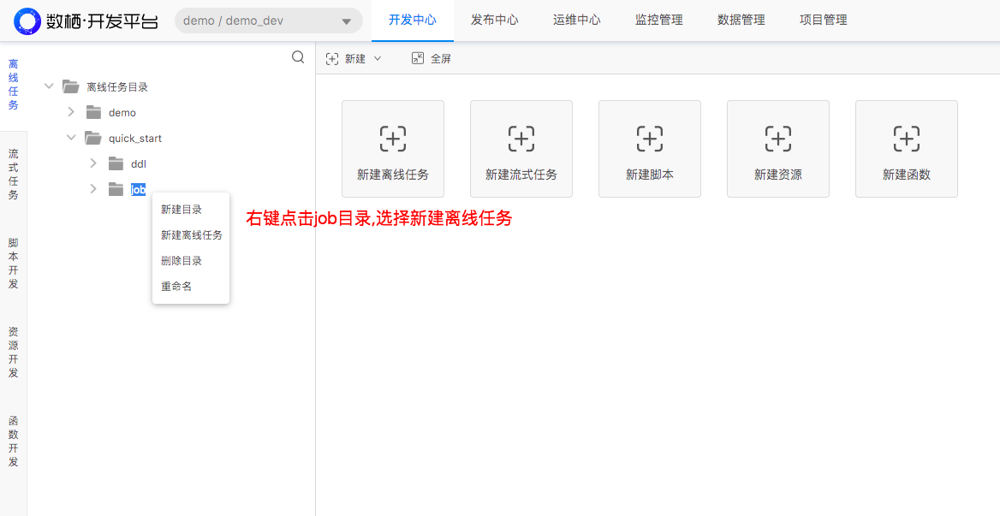

<h1> <center>数栖开发平台-帮助文档</center> </h1>

[TOC]

### 1. 平台介绍
#### 1.1 平台概述（白松）

```sql
-- drop table demo_tdm_user_complaint_position_count_d;

create table if not exists demo_tdm_user_complaint_position_count_d
(
	  user_id			bigint comment '业主ID'
	, name				string comment '业主姓名'
	, age				bigint comment '业主年龄'
	, address			string comment '业主小区'
	, city				string comment '城市'
	, position			string comment '投诉位置'
	, position_number	bigint comment '投诉次数'
)
comment '业主投诉位置次数统计'
partitioned by (ds string comment '按天分区,例如20160620')
stored as parquet;
```


#### 1.2 基本概念（段誉）

- 任务
- 脚本
- 资源
- 函数
- 实例
- 系统参数

### 2. 开通账户（段誉）

### 3. 快速入门 (明罡)

本文将演示如何将学生信息导入表中以及如何进行数据加工.

#### 3.1获取资源

所需的学生信息如下.复制学生信息,然后以txt格式存储为文件,文件名字为student_info.txt.

```Txt
1	赵晓丽	23	50
2	王明	25	60
3	王勇	22	55
4	杜孟娟	21	50
5	李志刚	22	56
6	张林静	23	51
```

这些学生信息已经上传到Github.[student_info.txt](https://github.com/dtwave/shuxi/blob/master/data/student/student_info.txt)如图3-1-1所示.


​									图 3-1-1 Github上学生信息

#### 3.2 上传资源

一般地,我们会在资源目录下再次创建目录,并以任务名作为新建的目录名.

如本快速入门的任务名为quick_start.那我们就在资源目录下新建**quick_start**目录.

各级任务目录只是规范,不做强制性要求.在实际开发中一个根目录下(如这里的资源目录),我们会存放各种任务的不同类型的不同名字的资源,创建分级目录将会帮助我们快速查找资源,便于维护.

1)  新建资源目录

a.进入数栖开发平台后,在**开发中心**下的**资源开发**页面,右键点击**资源目录**,选择**新建目录**.如图3-2-1所示.


​									图 3-2-1 新建资源目录

b.数据目录名为**quick_start**,点击**确定**即可完成目录创建.如图3-2-2所示.我们的资源文件student_info.txt将放在此目录下. 


​									图 3-2-2 创建资源目录quick_start目录

2)  新建资源

a.右键点击上步创建的**quick_start**目录,选择新建资源.如图3-2-3所示


​									图 3-2-3 新建资源步骤a


b.输入资源名student_info,选择资源类型为txt.点击添加文件如图3-2-4所示

文件类型支持文本txt,编译后的jar包,python脚本.且各文件名要以文件类型为后缀名.如本次要上传的文件**student_info.txt**以txt为后缀名.

文件大小最多可上传50M.


​									图 3-2-4 新建资源步骤b

c.选择创建好的student_info.txt文件,上传文件后会显示所上传资源信息.如图3-2-5所示.资源名为student_info.txt,大小为101B

点击确定,完成上传文件,上传时间依文件大小而定.


​									图 3-2-5 显示上传资源信息

d.其他姿势 重命名文件或者修改责任人亦或重新上传文件,可右击文件,选择**配置**,如图3-2-6所示


​									图 3-2-6 选择配置,修改文件信息步骤a

在资源配置弹窗中修改文件名或修改责任人或重新上传文件.如图3-2-7所示


​									图 3-2-7 选择配置,修改文件信息步骤b

#### 3.3 新建表

一般地,我们会在离线任务目录下再次新建目录,并以任务名作为新建的目录名,同时在此目录下创建ddl与job目录,ddl目录存放建表任务,job任务存放数据处理任务.

如本快速入门的任务名为quick_start.那我们就在**离线任务目录**下新建**quick_start**目录,同时在此目录下创建ddl与job目录.

创建分级目录将会使任务结构清晰,能帮助我们快速查找任务,便于维护.

1)  创建离线任务目录

在**开发中心**下,点击**离线任务**,右键点击**离线任务目录**,选择**新建目录**,新建quick_start目录.如图3-3-1所示

						

​									图 3-3-1 任务目录

2)  创建ddl与job目录

在新建的quick_start任务目录下,创建ddl与job目录.

ddl目录存放建表任务,job任务存放数据处理任务.如图3-3-2所示


​									图 3-3-2 创建ddl与job目录


3)  在ddl目录下创建建表任务,右键单击ddl目录,在弹框中选择新建离线任务,如图3-3-3所示


​									图 3-3-3 创建建表任务a


4) 输入任务名ddl_quick_start_student_info,选择任务类型为SparkSQL,点击确定,完成表创建工作,如图3-3-4所示

ddl目录下任务命名一般为ddl\_表名.此为推荐命名规则,不强制要求,详细[命名规范](https://github.com/dtwave/shuxi/blob/master/doc/%E6%95%B0%E6%A0%96%E5%BC%80%E5%8F%91%E5%B9%B3%E5%8F%B0-%E5%B8%AE%E5%8A%A9%E6%96%87%E6%A1%A3.md)

任务类型为SparkSQL,表明我们将采用sparksql任务创建表,在任务中只用输入建表语句即可.


​									图 3-3-4 创建建表任务b

建表语句如下,我们以任务名\_表内容作为表名.

```sql
-- 如果表已存在,可以删除掉.
-- drop table if exists quick_start_student_info;

-- 新建学生表
create table if not exists quick_start_student_info
(
      id		bigint comment 'ID'
	, name		string comment '姓名'
	, age		bigint comment '年龄'
	, weight	bigint comment '体重(kg)'
)
comment '学生基本信息'
row format delimited
fields terminated by'\t' 
lines terminated by'\n'
stored as textfile;
```

5) 点击运行,创建quick_start_student_info表,如图3-3-5所示


​									图 3-3-5 创建quick_start_student_info表


运行部分日志如图3-3-6所示,如果显示**任务运行成功(Finished)**,则表示表创建成功.

可以使用desc quick_start_student_info命令查看quick_start_student_info表字段信息,这里不在演示.


​									图 3-3-6 执行建表语句任务部分日志

#### 3.4 导入数据

1)  创建导入数据任务

a.右键点击**job**目录,选择**新建离线任务**,任务为quick_start_student_info,任务类型为hive.点击**确定**如图3-4-1,3-4-2所示



​									图 3-4-1 创建导入数据任务步骤a

hive任务类型表明导入数据语句将以hivesql的方式运行.


​									图 3-4-2 创建导入数据任务步骤b									

导入数据语句如下:

```sql
-- 导入学生信息
load data local inpath '{student_info.txt}' overwrite into table quick_start_student_info;

-- 预览数据(支持选中执行)
select * from quick_start_student_info limit 10;
```

2)  运行导入数据任务

a.此任务需要在页面右侧的属性配置里设置资源依赖.资源为我们前面上传的**student_info.txt**文件.点击**运行**,执行数据导入语句.如图3-4-3所示


​									图 3-4-3 导入数据到quick_start_student_info表

b.点击**运行**,运行日志部分如图3-4-4所示,如果出现**任务运行成功(Finished)**,则表示导入数据成功.

可以在日志中看到导入数据到表中以后,从表中查询出的数据,Hive任务查询出的结果不能保存,再次运行任务,上次任务结果将会被清空.


​										图 3-4-4 任务quick_start_student_info部分日志

#### 3.5 加工数据

1)  创建数据加工任务

a.右键点击**job**目录,选择**新建离线任务**,任务为quick_start_student_statistics,任务类型为SparkSQL.点击**确定**如图3-5-1,3-5-2所示


​									图 3-5-1 创建数据加工任务步骤a


​									图 3-5-2 创建数据加工任务步骤b

加工数据语句如下:

```sql
-- 1. 查询学生基本信息
select
		 id
       , name
       , age
       , weight
from quick_start_student_info
order by age;


-- 2. 查询学生最大年龄、最小体重
select
	  max(age)
    , min(weight)
from quick_start_student_info;
```

2)  运行数据加工任务

a.点击运行,进行数据加工,以此获得学生基本信息及学生最大年龄和最小体重.如图3-5-3所示


​									图 3-5-3 运行数据加工任务

b.点击运行,运行日志部分如图3-5-4所示,如果出现**任务运行成功(Finished)**,则表示语句执行成功.点击**运行结果1**,**运行结果2**.可以看到我们加工数据获得的结果.

我们可以在任务执行过程中点击日志栏的垃圾箱图标来清空已有日志.


​									图 3-5-4 运行日志及结果

sparksql获得的结果不会在下次执行任务的时候被清空.

sparksql的执行结果最多返回5000条记录.可以通过翻页来查看数据,也可以把数据以csv格式下载下来.如图3-5-5所示.


​									图 3-5-5 运行日志及结果

### 4. 用户手册

#### 4.1 开发中心(明罡)
##### 4.1.1 任务操作
###### 4.1.1.1 新建
###### 4.1.1.2 复制
###### 4.1.1.3 删除
###### 4.1.1.4 格式化
###### 4.1.1.5 代码检查
###### 4.1.1.6 运行

- 选中执行

###### 4.1.1.7 提交

##### 4.1.2 属性配置
###### 4.1.2.1 运行参数 

- 用户自定义参数
- 系统参数

###### 4.1.2.2 调度配置

- 正常调度
- 跨周期调度
- 暂停调度

###### 4.1.2.3 依赖配置

- 资源依赖
- 任务依赖

###### 4.1.2.4 基线配置
###### 4.1.2.5 资源组配置

##### 4.1.3 任务类型
###### 4.1.3.1 Shell
###### 4.1.3.2 DataSync
###### 4.1.3.3 Hive
###### 4.1.3.4 SparkSQL
###### 4.1.3.5 Python
###### 4.1.3.6 PySpark
###### 4.1.3.7 Spark
###### 4.1.3.8 hive2
###### 4.1.3.9 presto
###### 4.1.3.10 FlinkSQL
###### 4.1.3.11 Flink

#### 4.2 发布中心（明罡）
##### 4.2.1 创建发布包
##### 4.2.2 发布历史
- 查看
- 发布
- 撤销

#### 4.3 运维中心（明罡）
##### 4.3.1 运行总览
##### 4.3.2 离线实例
###### 4.3.2.1 展开父节点
###### 4.3.2.2 展开子节点
###### 4.3.2.3 查看运行日志
###### 4.3.2.4 查看代码
###### 4.3.2.5 终止
###### 4.3.2.6 重跑
###### 4.3.2.7 重跑下游
###### 4.3.2.8 置成功
##### 4.3.3 离线任务
###### 4.3.3.1 补数据

- 自依赖
###### 4.3.3.2 补下游

##### 4.3.4 流任务

#### 4.4 监控管理（段誉）
##### 4.4.1 基线管理
###### 4.4.1.1 新建基线
###### 4.4.1.2 编辑基线
###### 4.4.1.3 删除基线
##### 4.4.2 基线告警
##### 4.4.3 数据质量告警

#### 4.5 数据管理（段誉）
##### 4.5.1 全局预览
##### 4.5.2 元数据管理
###### 4.5.2.1 生命周期
###### 4.5.2.2 数据血缘
##### 4.5.3 数据质量
##### 4.5.4 数据目录
###### 4.5.4.1 数据类目
###### 4.5.4.2 标签类目
##### 4.5.6 术语项管理

#### 4.6 项目管理（白松）
##### 4.6.1 项目配置
##### 4.6.2 成员管理
##### 4.6.3 资源组管理
##### 4.6.4 计算引擎管理
###### 4.6.4.1 离线引擎
###### 4.6.4.2 即席引擎
##### 4.6.6 数据源管理

#### 4.7 高级功能
##### 4.7.1 部署方案
###### 4.7.1.1 公有云
###### 4.7.1.2 私有云
###### 4.7.1.3 混合云

- 技术方案
- 部署实施

##### 4.7.2 新建项目空间

- 新建项目
- 添加资源组
- 配置计算引擎

### 4. 案例实战（明罡）
#### 4.1 背景介绍
#### 4.2 数据开发流程介绍
#### 4.3 开发
##### 4.3.1 DIM层
##### 4.3.2 ODS层
##### 4.3.3 DWD层
##### 4.3.4 TDM层
##### 4.3.5 ADM层
##### 4.3.6 配置基线
#### 4.4 发布
#### 4.5 运维
#### 4.6 数据管理
##### 4.6.1 配置数据质量
##### 4.6.2 配置生命周期
##### 4.6.3 查看数据血缘

### 5. 视频教程（段誉）
#### 5.1 新建项目空间
#### 5.2 新建函数
#### 5.3 新建、提交、发布任务
#### 5.4 基线管理
#### 5.5 元数据管理
#### 5.6 数据质量

### 6. 常见问题（白松）
### 7. 用户建议（白松）

### 8. Github地址（白松）