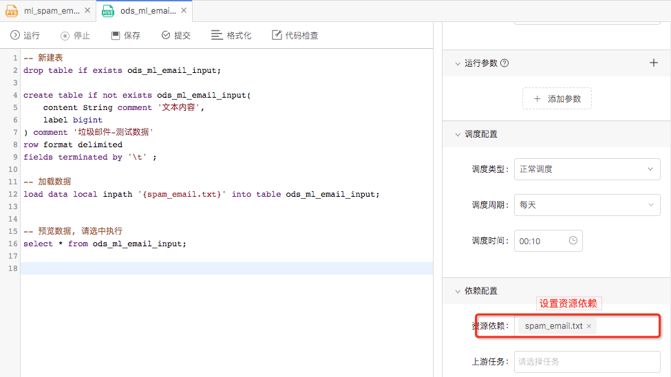

<h1> <center>数栖开发平台-帮助文档</center> </h1>

[TOC]

### 1. 平台介绍
#### 1.1 平台概述（白松）

```sql
-- drop table demo_tdm_user_complaint_position_count_d;

create table if not exists demo_tdm_user_complaint_position_count_d
(
	  user_id			bigint comment '业主ID'
	, name				string comment '业主姓名'
	, age				bigint comment '业主年龄'
	, address			string comment '业主小区'
	, city				string comment '城市'
	, position			string comment '投诉位置'
	, position_number	bigint comment '投诉次数'
)
comment '业主投诉位置次数统计'
partitioned by (ds string comment '按天分区,例如20160620')
stored as parquet;
```




#### 1.2 基本概念（段誉）

- 任务
- 脚本
- 资源
- 函数
- 实例
- 系统参数

### 2. 开通账户（段誉）

### 3. 快速入门 (明罡)
#### 3.1 上传资源
#### 3.2 新建表
#### 3.3 导入数据
#### 3.4 加工数据

### 4. 用户手册
#### 4.1 开发中心(明罡)
##### 4.1.1 任务操作
###### 4.1.1.1 新建
###### 4.1.1.2 复制
###### 4.1.1.3 删除
###### 4.1.1.4 格式化
###### 4.1.1.5 代码检查
###### 4.1.1.6 运行

- 选中执行

###### 4.1.1.7 提交

##### 4.1.2 属性配置
###### 4.1.2.1 运行参数 

- 用户自定义参数
- 系统参数

###### 4.1.2.2 调度配置

- 正常调度
- 跨周期调度
- 暂停调度

###### 4.1.2.3 依赖配置

- 资源依赖
- 任务依赖

###### 4.1.2.4 基线配置
###### 4.1.2.5 资源组配置

##### 4.1.3 任务类型
###### 4.1.3.1 Shell
###### 4.1.3.2 DataSync
###### 4.1.3.3 Hive
###### 4.1.3.4 SparkSQL
###### 4.1.3.5 Python
###### 4.1.3.6 PySpark
###### 4.1.3.7 Spark
###### 4.1.3.8 hive2
###### 4.1.3.9 presto
###### 4.1.3.10 FlinkSQL
###### 4.1.3.11 Flink

#### 4.2 发布中心（明罡）
##### 4.2.1 创建发布包
##### 4.2.2 发布历史
- 查看
- 发布
- 撤销

#### 4.3 运维中心（明罡）
##### 4.3.1 运行总览
##### 4.3.2 离线实例
###### 4.3.2.1 展开父节点
###### 4.3.2.2 展开子节点
###### 4.3.2.3 查看运行日志
###### 4.3.2.4 查看代码
###### 4.3.2.5 终止
###### 4.3.2.6 重跑
###### 4.3.2.7 重跑下游
###### 4.3.2.8 置成功
##### 4.3.3 离线任务
###### 4.3.3.1 补数据

- 自依赖
###### 4.3.3.2 补下游

##### 4.3.4 流任务

#### 4.4 监控管理（段誉）
##### 4.4.1 基线管理
###### 4.4.1.1 新建基线
###### 4.4.1.2 编辑基线
###### 4.4.1.3 删除基线
##### 4.4.2 基线告警
##### 4.4.3 数据质量告警

#### 4.5 数据管理（段誉）
##### 4.5.1 全局预览
##### 4.5.2 元数据管理
###### 4.5.2.1 生命周期
###### 4.5.2.2 数据血缘
##### 4.5.3 数据质量
##### 4.5.4 数据目录
###### 4.5.4.1 数据类目
###### 4.5.4.2 标签类目
##### 4.5.6 术语项管理

#### 4.6 项目管理（白松）
##### 4.6.1 项目配置
##### 4.6.2 成员管理
##### 4.6.3 资源组管理
##### 4.6.4 计算引擎管理
###### 4.6.4.1 离线引擎
###### 4.6.4.2 即席引擎
##### 4.6.6 数据源管理

#### 4.7 高级功能
##### 4.7.1 部署方案
###### 4.7.1.1 公有云
###### 4.7.1.2 私有云
###### 4.7.1.3 混合云

- 技术方案
- 部署实施

##### 4.7.2 新建项目空间

- 新建项目
- 添加资源组
- 配置计算引擎

### 4. 案例实战（明罡）
#### 4.1 背景介绍
#### 4.2 数据开发流程介绍
#### 4.3 开发
##### 4.3.1 DIM层
##### 4.3.2 ODS层
##### 4.3.3 DWD层
##### 4.3.4 TDM层
##### 4.3.5 ADM层
##### 4.3.6 配置基线
#### 4.4 发布
#### 4.5 运维
#### 4.6 数据管理
##### 4.6.1 配置数据质量
##### 4.6.2 配置生命周期
##### 4.6.3 查看数据血缘

### 5. 视频教程（段誉）
#### 5.1 新建项目空间
#### 5.2 新建函数
#### 5.3 新建、提交、发布任务
#### 5.4 基线管理
#### 5.5 元数据管理
#### 5.6 数据质量

### 6. 常见问题（白松）
### 7. 用户建议（白松）

### 8. Github地址（白松）