<h1> <center>数栖开发平台-帮助文档</center> </h1>

[TOC]

### 1. 平台介绍
#### 1.1 平台概述

数栖平台是一站式大数据开发应用平台，帮助企业快速构建数据资产，唤醒沉睡的数据价值。

数栖平台提供从数据采集交换、模型设计、计算加工、数据验证、数据应用等全链路的解决方案；通过平台一站式可以完成开发、运维、监控、数据管理等全链路数据资产化操作，并且整个数据应用加工流程可视化、模块化，能极大的方便业务人员对数据加工处理，跟踪管理数据关系流程等，有效提高数据应用开发的效率；支持多种存储计算框架（Hadoop、Spark等），根据用户需求以插件化的形式接入各类存储计算框架，适配不同客户的业务场景；提供开发/生产环境隔离机制，开发环境中进行代码调试验证，之后发布到生产环境，从根本上保证稳定性和安全性；提供租户级别隔离安全机制，搭配租户内管理员、开发、运维、访客等多种角色权限；提供DAG可视化操作界面、支持天、周、月多种跨周期调度依赖配置；提供基线管理，支持邮件、短信、电话、钉钉多种任务运行状况告警方式，保障业务稳定。

#### 1.2 基本概念

- 任务

任务（Task）描述数栖开发平台数据采集和处理过程的基本单元。具体任务类型请详见任务类型模块(4.1.3)。任务可自由配置参数、调度时间、任务间的依赖关系和任务基线等；多个任务间可配置依赖关系，组成DAG图。

- 脚本

脚本(script)主要给数据开发人员调试使用，仅能进行查询和分析数据操作，无法进行调度配置和基线配置。

- 资源

资源(resource)可被研发人员共享和使用的客观存在。目前支持的三种资源:

​        jar包：开发完成Java编程后编译成的jar

​        txt：文本文件，可直接编辑

​        python：python代码，可直接编辑 

- 函数

系统提供内建函数完成一定的计算和计数功能，但当内建函数无法满足要求时，您可以使用数栖平台提供的 java 编程接口开发自定义函数（User Defined Function，以下简称 UDF）。在开发完成 UDF 代码后，需要将代码编译成 jar 包，并将此 jar 包以 jar 资源的形式上传到，最后注册生成UDF。

- 实例

实例指的是任务实例(Instance)，任务在执行行前会被实例化，实例正常运行会经历待运行(Waiting)、运行(Running)、结束(Terminated)三个阶段。

- 参数

参数(parameter)是使用通用变量来建立函数和变量之间关系。

### 2. 开通账户(是否可以去掉)

数澜的帐户登录体系和数栖平台的登录体系保持一致，帐户申请方式统一从数澜官网上申请。

#### 2.1 平台帐户申请

平台帐户指的是有使用数栖平台的权限。

1.  登陆数澜官网https://www.dtwave.com/，点击Dw.SaaS，之后点击“公测申请试用”。

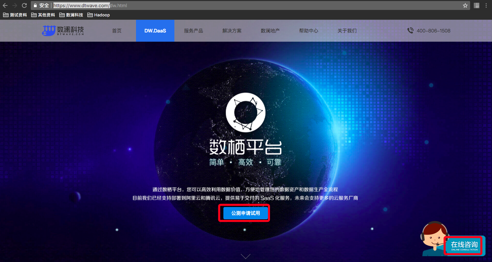<center>图2-1-1 公测申请页</center>

2.  进入信息填写界面，填写相应真实信息，点击“提交”。

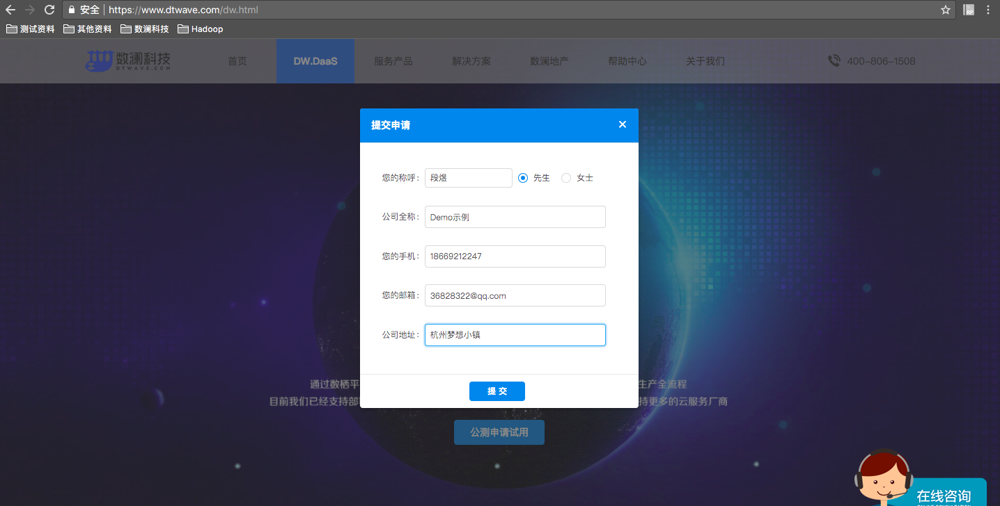<center>图2-1-2 申请提交页</center>

3.  至此已完成申请流程，运营人员会在1-3天内尽快将相关帐户信息发送到您的邮箱；如果想要申请管理员帐户请联系在线客服人员。

#### 2.2 平台帐户开通

项目空间管理员可以对单个空间项目下的项目成员进行配置。

1. 用申请的帐户登陆数栖开发平台http://ide.dtwave-inc.com/，进入到“项目管理”界面。

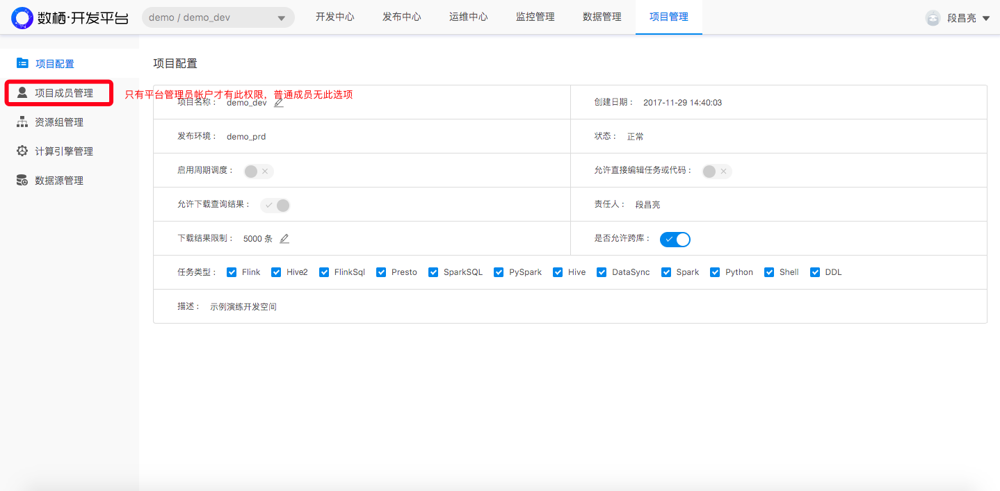<center>图2-2-1 数栖开发平台项目管理界面</center>

2.  点击项目成员管理（只有平台管理员的权限才有此选项）此界面可查看已添加的成员，还能添加项目成员和移出项目成员，各成员角色请见**角色权限信息**附件。

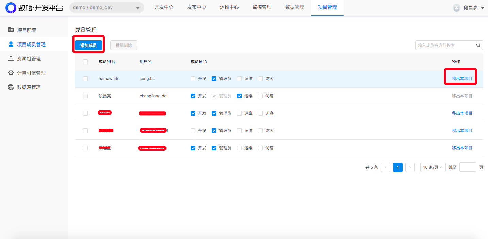<center>图2-2-2 项目成员管理界面</center>

3.  点击“添加成员”，出现成员下拉列表（此处成员必须和申请的帐户为同一租户），可选多个成员，选择成员完成后，分配相应的角色。

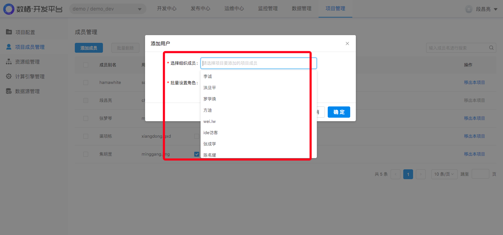<center>图2-2-3 项目成员添加</center>

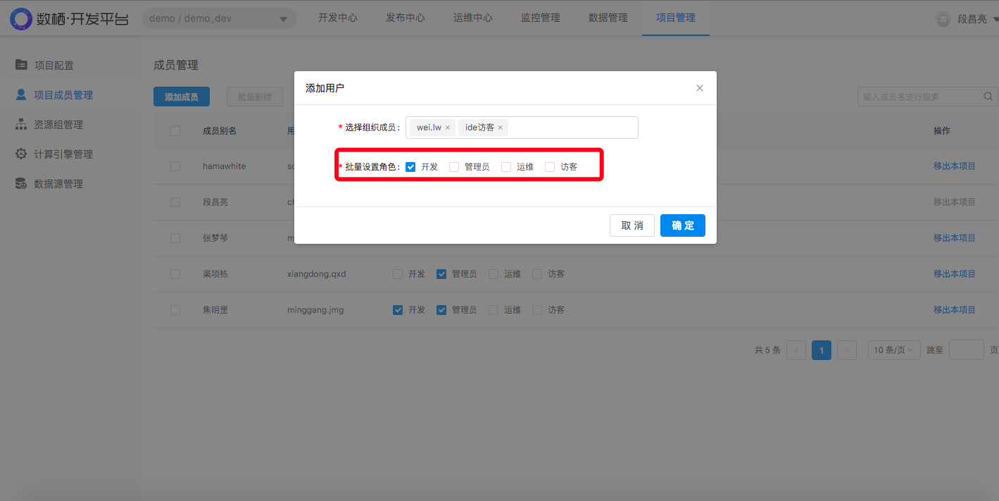<center>图2-2-4 项目成员添加</center>

4. 返回项目成员管理页可看到刚两帐户已添加成功。

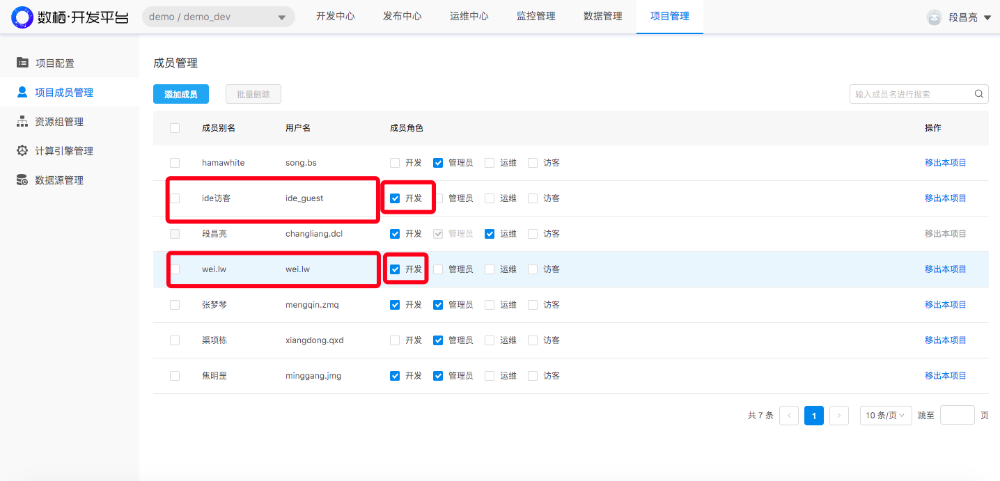<center>图2-2-5 项目成员列表</center>

5. 项目成员删除，选择成员后面的“操作”-“移出本项目”即可。
6. 项目成员批量删除，成员列表“方框”打勾选择，点击“批量删除”。

### 3. 快速入门 

本文将演示如何将学生信息导入Hive表中以及如何进行数据加工的流程。

#### 3.1 获取资源

所需的学生信息如下：复制学生信息，然后以txt格式存储为文件，文件名为student_info.txt。

```Txt
1 赵晓丽 23  50
2 王明  25  60
3 王勇  22  55
4 杜孟娟 21  50
5 李志刚 22  56
6 张林静 23  51
```

这些学生信息已经上传到Github，[student_info.txt](https://github.com/dtwave/shuxi/blob/master/data/student/student_info.txt)如图3-1-1所示：

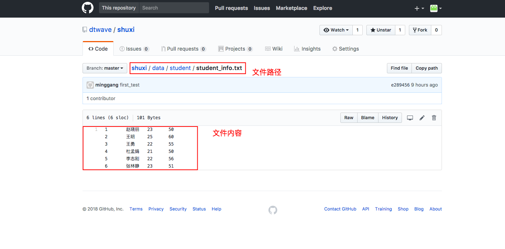<center>图 3-1-1 Github上学生信息</center>

#### 3.2 上传资源

一般地，我们会在资源目录下创建次级目录，并以任务名作为新建的目录名。例如：本快速入门的任务名为quick_start，那我们就在资源目录下新建**quick_start**目录。

各级任务目录只是规范，不做强制性要求。在实际开发中一个根目录下(如这里的资源目录)，我们会存放各种任务的不同类型的不同名字的资源，创建分级目录将会帮助我们快速查找资源便于维护。

1)  新建资源目录

​ 进入数栖开发平台后，在**开发中心**下的**资源开发**页面，右键点击**资源目录**，选择**新建目录**。如图3-2-1所示：

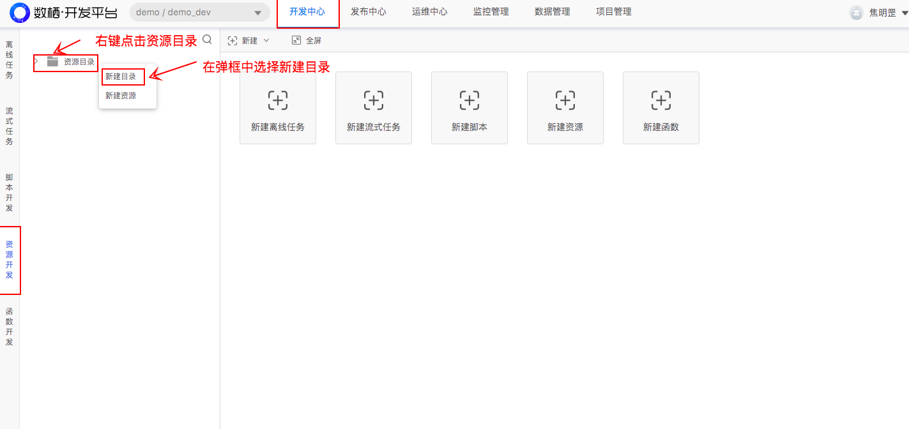 <center>图 3-2-1 新建资源目录</center>

目录名为**quick_start**，点击**确定**完成目录创建，资源文件student_info.txt将放在此目录下。如图3-2-2所示：

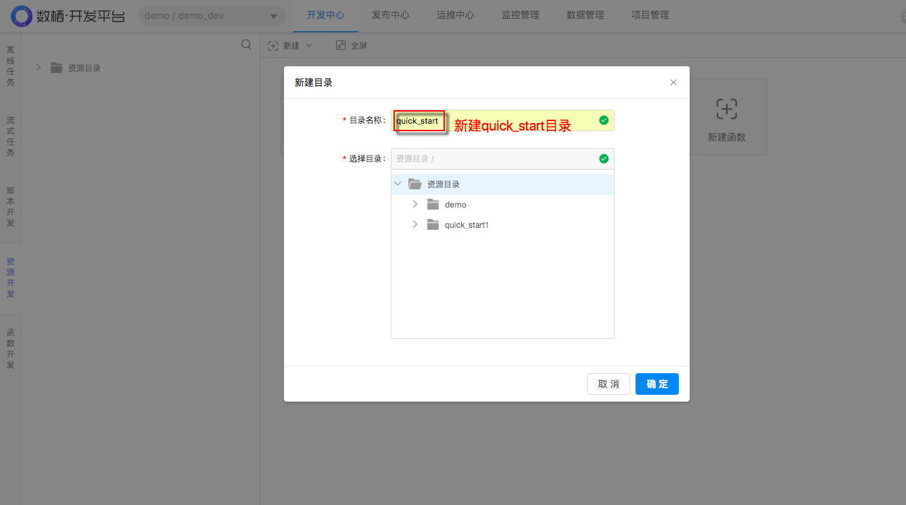<center>图 3-2-2 新建资源目录</center>

2)  新建资源

右键点击上步创建的**quick_start**目录，选择新建资源。如图3-2-3所示：

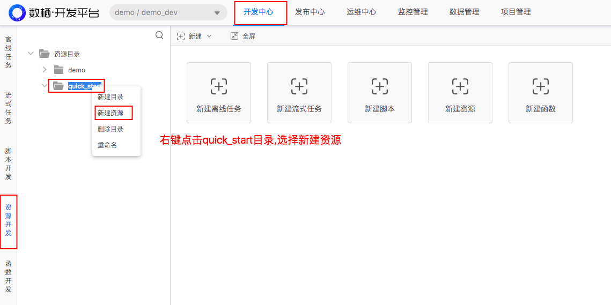<center>图 3-2-3 新建资源步骤</center>

输入资源名student_info，选择资源类型为txt，点击添加文件如图3-2-4所示。文件类型支持文本txt、编译后的jar包、python脚本，且各文件名要以文件类型为后缀名。例如：本次要上传的文件**student_info.txt**以txt为后缀名。最多可上传50M的文件。

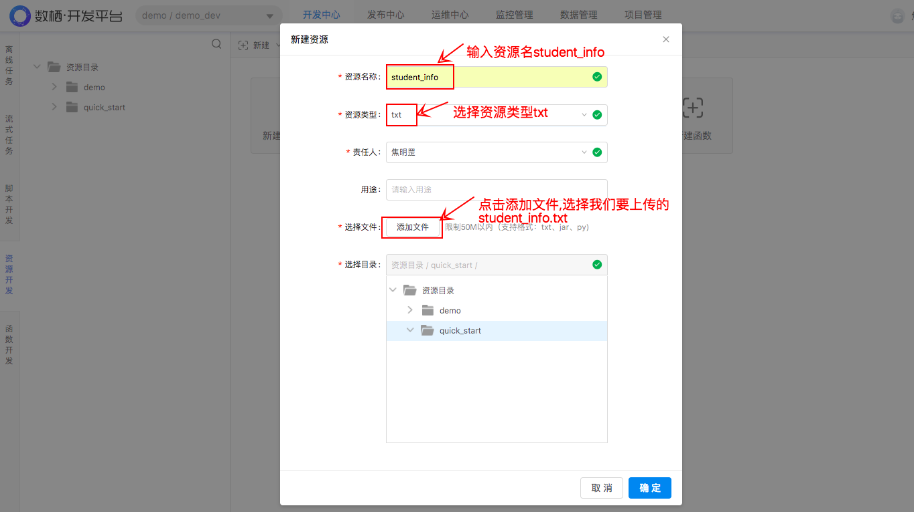<center>图 3-2-4 新建资源步骤</center>

选择创建好的student_info.txt文件，上传文件后会显示所上传资源信息。如图3-2-5所示，资源名为student_info.txt，大小为101B。

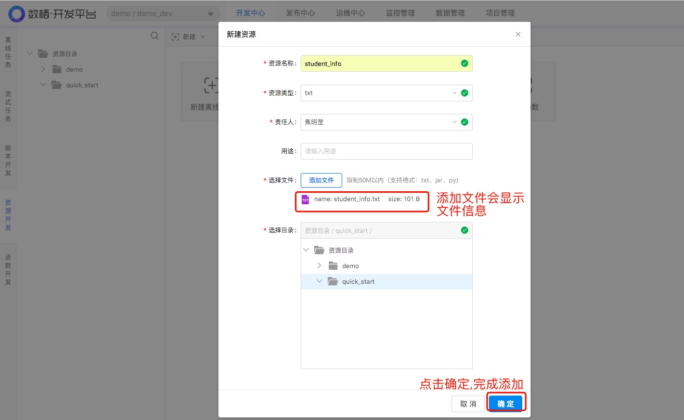<center>图 3-2-5 显示上传资源信息</center>

其他操作：重命名文件、修改责任人和重新上传文件，可右击文件，选择**配置**进行更新，如图3-2-6所示：

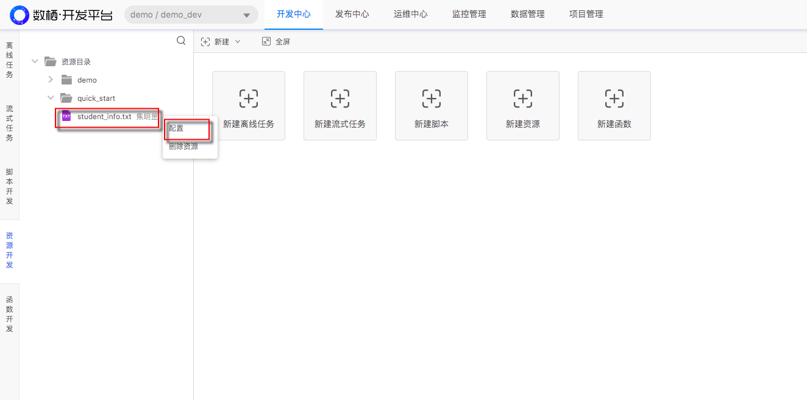  <center>图 3-2-6 修改资源信息</center>

在资源配置弹窗中修改文件名或修改责任人或重新上传文件。如图3-2-7所示：

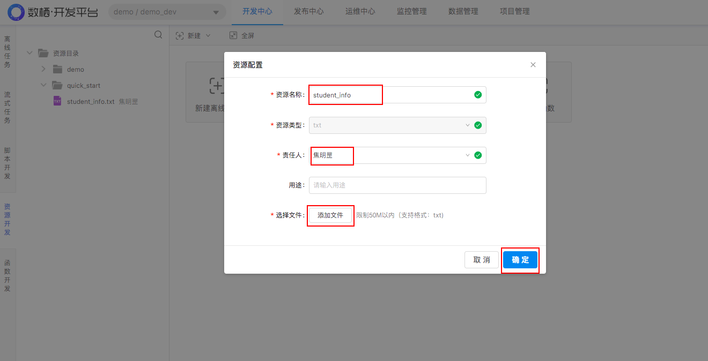<center>图 3-2-7 修改资源信息</center>

#### 3.3 新建表

一般地，我们会在离线任务目录下再次新建目录，并以任务名作为新建的目录名，同时在此目录下创建ddl与job目录：ddl目录存放建表任务、job任务存放数据处理任务。

例如：本快速入门的任务名为quick_start，那我们就在**离线任务目录**下新建**quick_start**目录，同时在此目录下创建ddl与job目录。创建分级目录将会使任务结构清晰，能帮助我们快速查找任务便于维护。

1)  创建离线任务目录

在**开发中心**下，点击**离线任务**，右键点击**离线任务目录**，选择**新建目录**，新建quick_start目录。如图3-3-1所示：

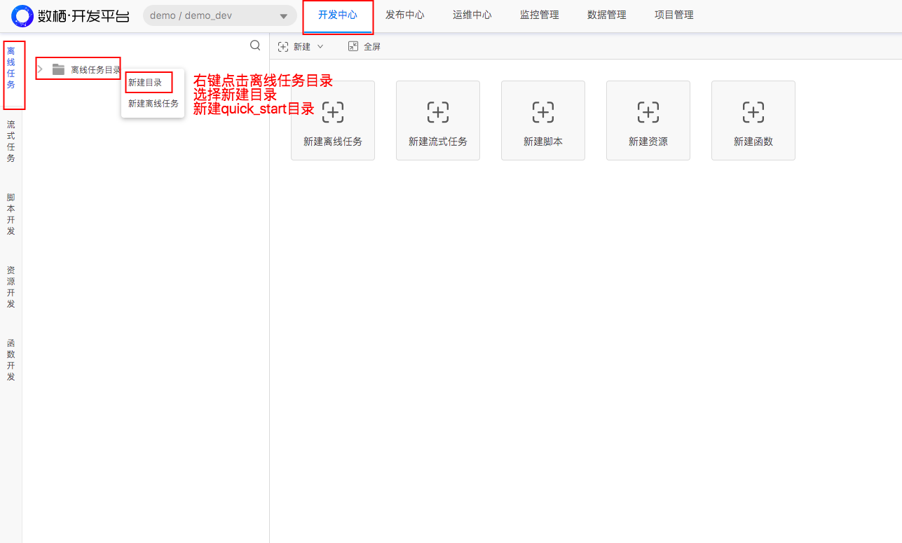           <center>图 3-3-1 任务目录</center>

2)  创建ddl与job目录

在新建的quick_start任务目录下，创建ddl与job目录。如图3-3-2所示：

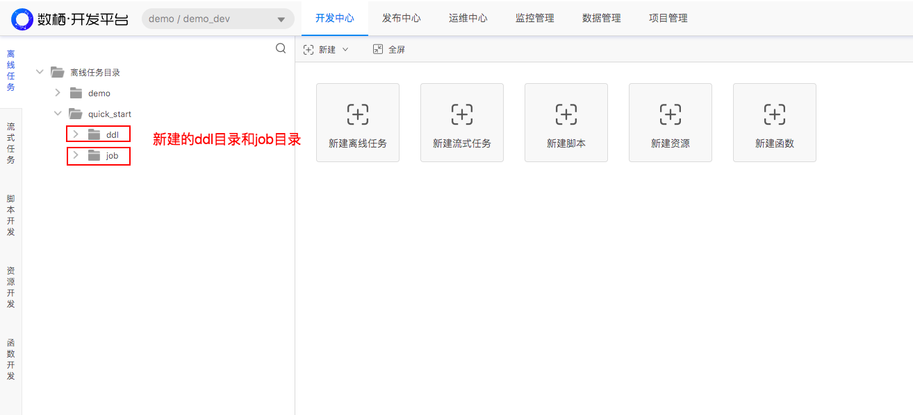<center>图 3-3-2 创建ddl与job目录</center>

3)  在ddl目录下创建建表任务，右键单击ddl目录，在弹框中选择新建离线任务，如图3-3-3所示: 

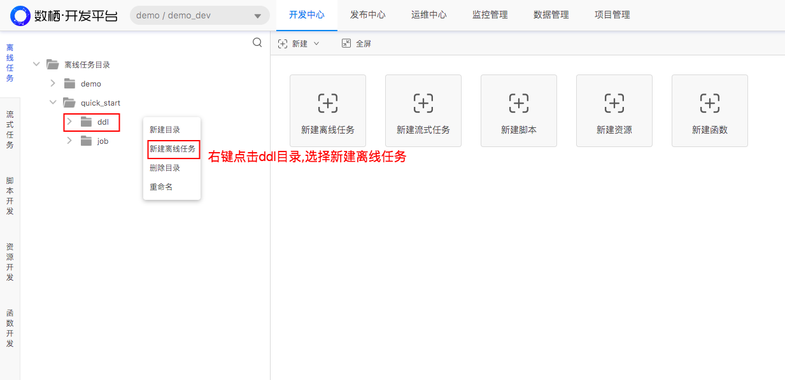<center>图 3-3-3 创建DDL任务</center>

4)  输入任务名ddl_quick_start_student_info，选择任务类型为DDL，如图3-3-4所示。

**提示：**ddl目录下任务命名一般为 ddl\_表名，详细[命名规范](https://github.com/dtwave/shuxi/blob/master/doc/%E6%95%B0%E6%A0%96%E6%95%B0%E6%8D%AE%E5%91%BD%E5%90%8D%E8%A7%84%E8%8C%83.md)，任务类型为DDL，在任务中只用输入建表语句即可。

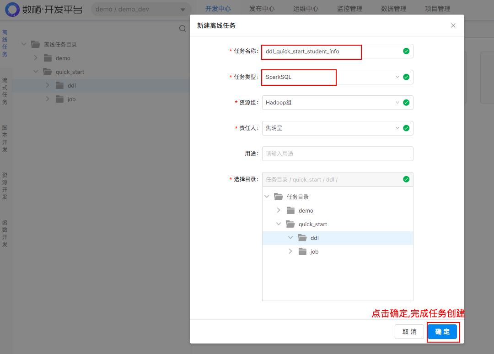<center>图 3-3-4 创建DDL任务</center>

建表语句如下，我们以任务名\_表内容作为表名，并且代码注释必须要以 ”--“ 开头，注释为单独一行。

```sql
-- 如果表已存在,可以删除掉.
-- drop table if exists quick_start_student_info;

-- 新建学生表
create table if not exists quick_start_student_info
(
      id    bigint comment 'ID'
  , name    string comment '姓名'
  , age   bigint comment '年龄'
  , weight  bigint comment '体重(kg)'
)
comment '学生基本信息'
row format delimited
fields terminated by'\t' 
lines terminated by'\n'
stored as textfile;
```

5)  点击运行，创建quick_start_student_info表。如图3-3-5所示：

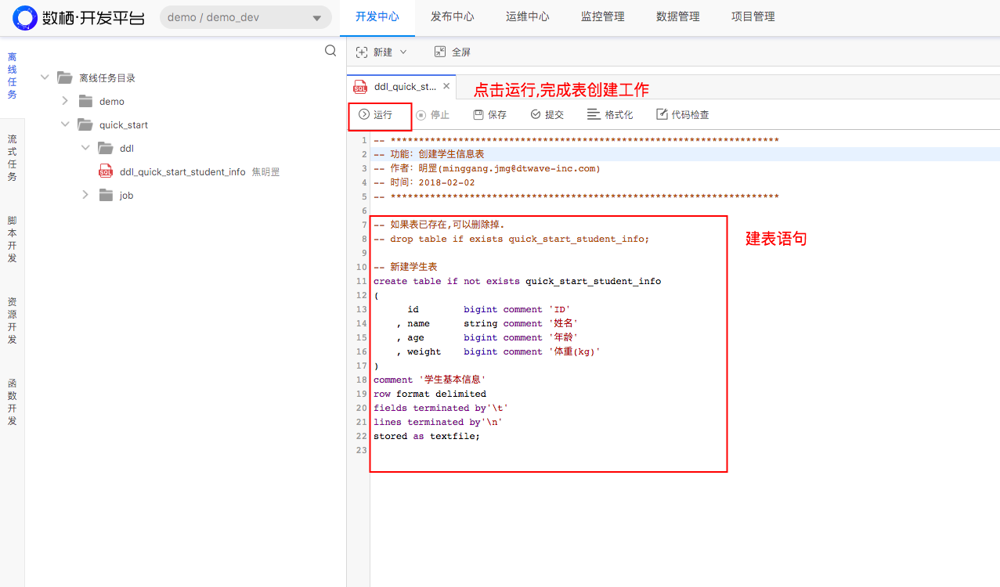<center>图 3-3-5 创建quick_start_student_info表</center>

运行部分日志如图3-3-6所示，如果显示**任务运行成功(Finished)**，则表示表创建成功，也可以使用desc quick_start_student_info命令查看表字段信息查看是否创建成功。

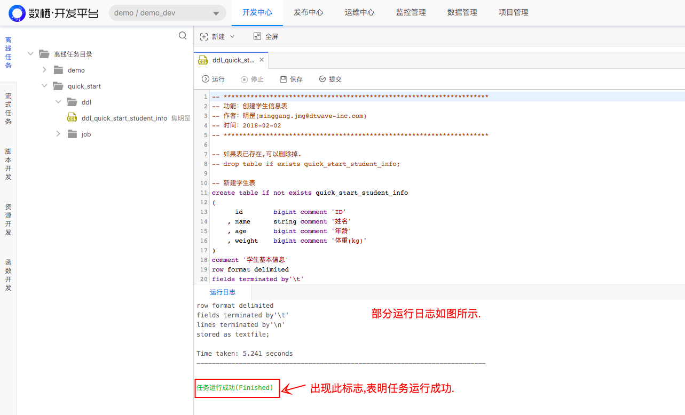<center>图 3-3-6 任务运行日志</center>

#### 3.4 导入数据

1)  创建导入数据任务

右键点击**job**目录，选择**新建离线任务**，任务名为quick_start_student_info，任务类型为hive。如图3-4-1、3-4-2所示：

<center>图 3-4-1 创建导入数据任务</center>

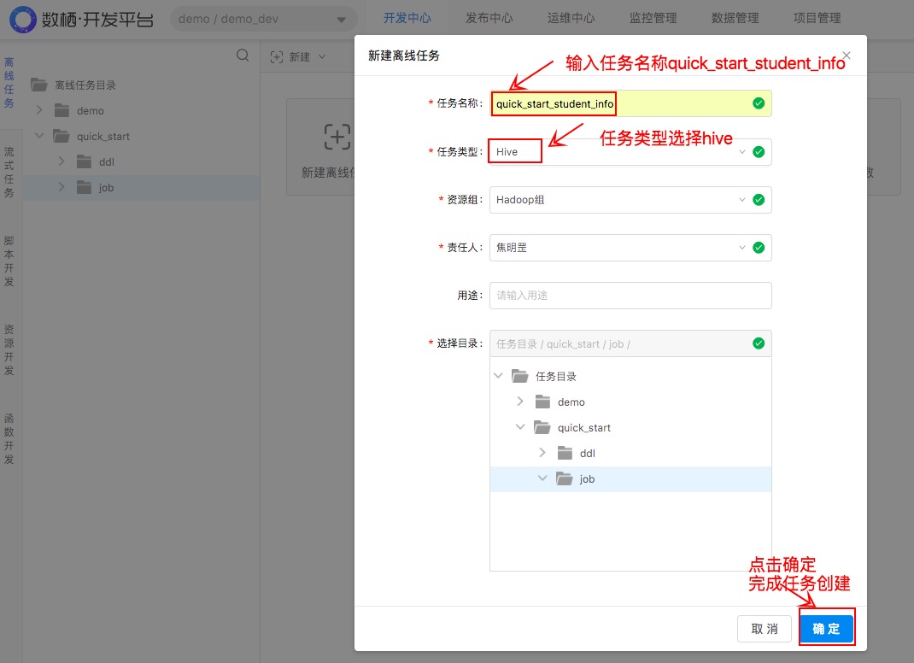<center>图 3-4-2 创建导入数据任务</center>       

导入数据语句如下:

```sql
-- 导入学生信息
load data local inpath '{student_info.txt}' overwrite into table quick_start_student_info;

-- 预览数据(支持选中执行)
select * from quick_start_student_info limit 10;
```

2)  运行导入数据任务

任务需要在页面右侧的属性配置里设置资源依赖，资源为我们前面上传的**student_info.txt**文件，点击**运行**，执行数据导入语句。如图3-4-3所示：

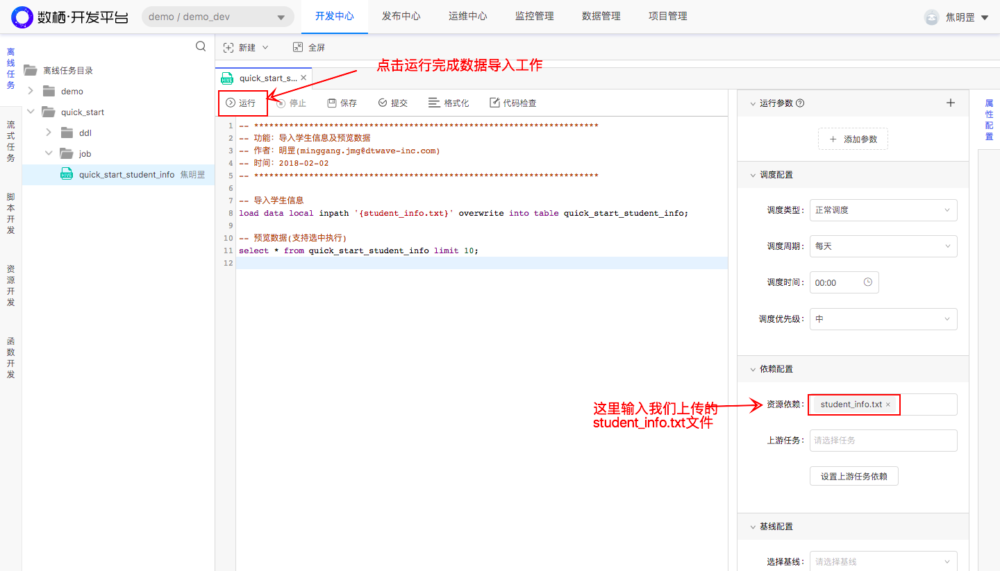 <center>图 3-4-3 数据导入</center>

​ 运行日志部分如图3-4-4所示，如果出现**任务运行成功(Finished)**，则表示导入数据成功。也可以通过select 语句从表中查询数据，Hive任务查询出的结果不能保存，再次运行任务，上次任务结果将会被清空。

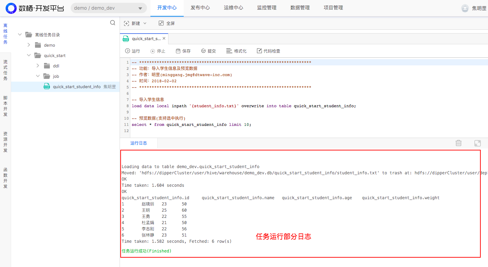<center>图 3-4-4 任务运行部分日志</center>

3)  其他导入数据的方式

​	1. 创建数据同步任务(DataSync)

​	2. 使用hadoop命令上传文件

#### 3.5 加工数据

1)  创建数据加工任务

右键点击**job**目录，选择**新建离线任务**，任务为quick_start_student_statistics，任务类型为SparkSQL，点击**确定**。如图3-5-1、3-5-2所示：

  <center>图 3-5-1 创建数据加工任务</center>

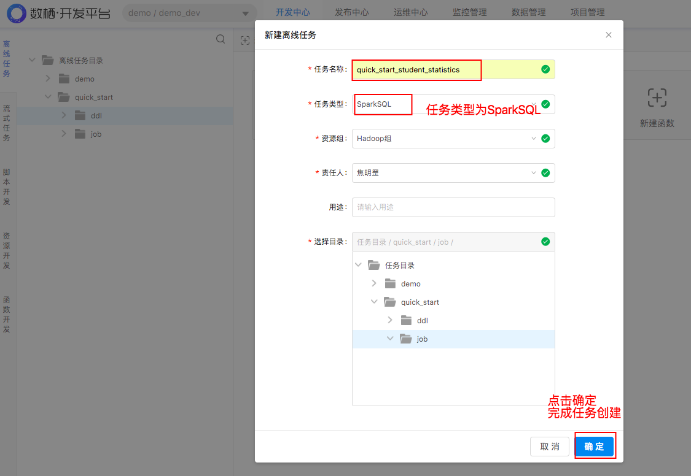 <center>图 3-5-2 创建数据加工任务</center>

加工数据语句如下:

```sql
-- 1. 查询学生基本信息
select
     id
       , name
       , age
       , weight
from quick_start_student_info
order by age;

-- 2. 查询学生最大年龄、最小体重
select
    max(age)
    , min(weight)
from quick_start_student_info;
```

2)  运行数据加工任务

运行进行数据加工，获得学生基本信息及学生最大年龄和最小体重。如图3-5-3所示:

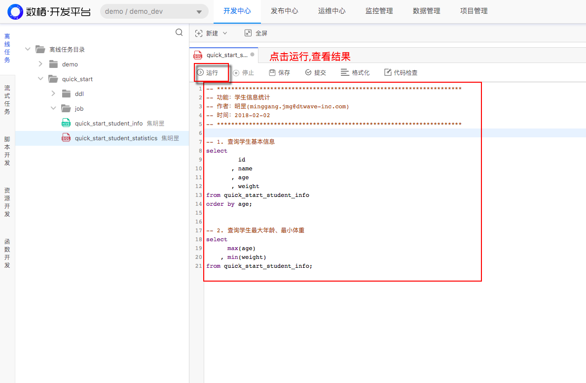<center>图 3-5-3 运行数据加工任务</center>

点击**运行结果1**、**运行结果2**，可以看到我们加工数据获得的结果，我们可以在任务执行过程中点击日志栏的垃圾箱图标来清空已有日志。

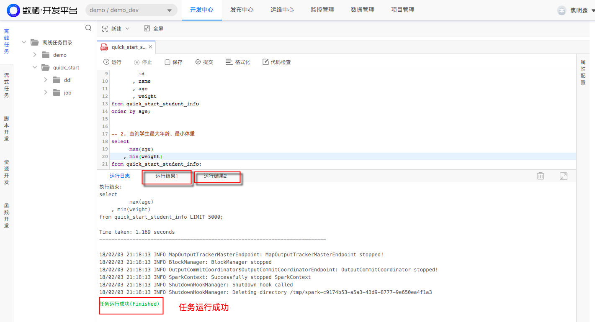<center>图 3-5-4 运行日志</center>

SparkSQL任务获得的结果不会在下次执行任务的时候被清空，并且执行结果最多返回5000条记录，可以通过翻页来查看数据，也可以把数据以csv格式下载下来。如图3-5-5所示：

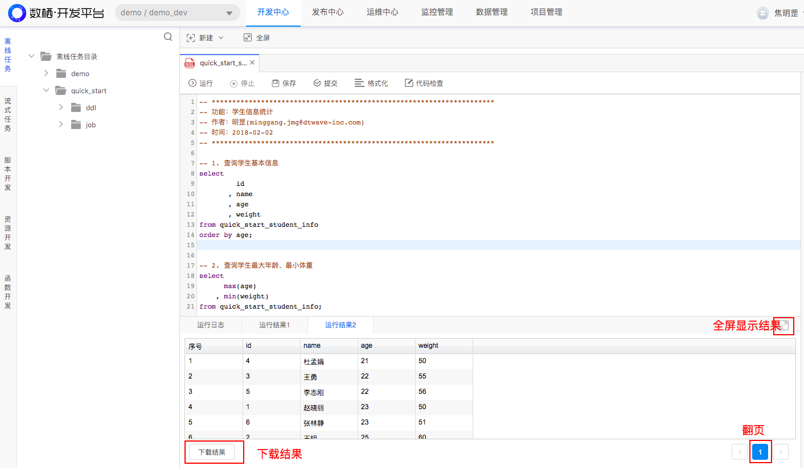<center>图 3-5-5 运行结果</center>

### 4. 用户操作手册

#### 4.1 开发中心
##### 4.1.1 任务操作
###### 4.1.1.1 新建

创建离线任务，选择任务将要存放目录，右击目录，选择**新建离线任务**，自定义任务名称，选择任务类型，点击**确定**，完成任务创建。如图4-1-1-1、4-1-1-2所示：

<center>图 4-1-1-1 创建离线任务</center>

<center>图 4-1-1-2 创建离线任务</center>

###### 4.1.1.2 复制

复制离线任务，新任务名默认为原文件名_copy，如图4-1-1-3、 4-1-1-4所示:

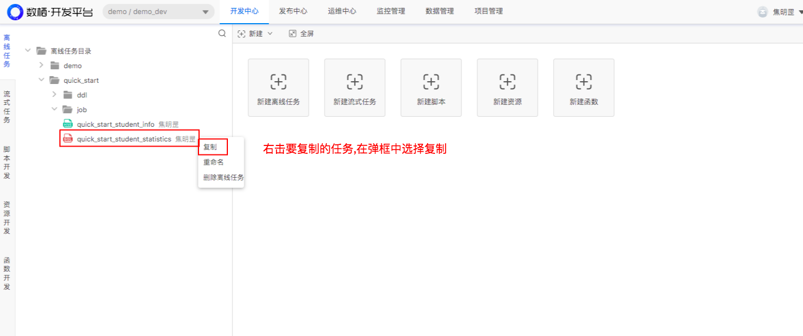<center>图 4-1-1-3 复制离线任务</center>

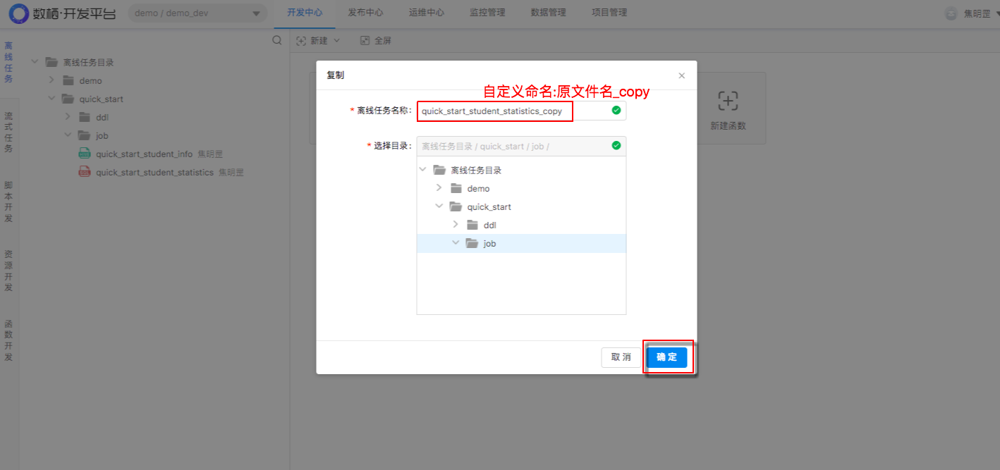<center>图 4-1-1-4 复制离线任务</center>

###### 4.1.1.3 删除

只能删除开发环境离线任务，右击要删除的任务，选择**删除离线任务**，点击**确定**，完成删除。如图4-1-1-5、4-1-1-6 所示 。删除需慎重，删除后不可恢复，需要删除生产环境离线任务时，先在开发环境删除该任务，通过发布中心重新发布进行删除。

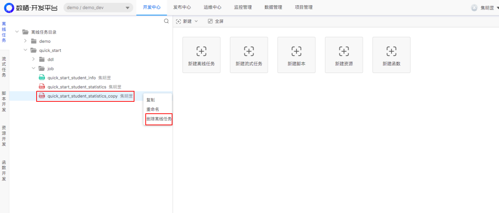<center>图 4-1-1-5 删除离线任务</center>

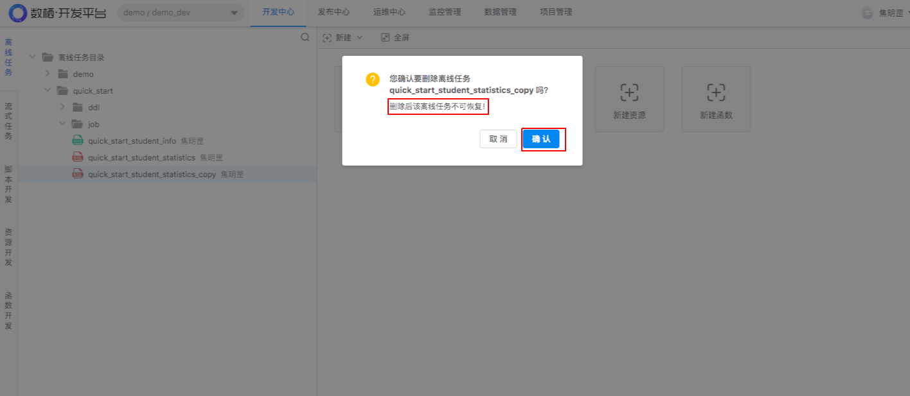<center>图 4-1-1-6 删除离线任务</center>

###### 4.1.1.4 格式化

格式化语句，选中想要格式化的语句，点击**格式化**。如图4-1-1-7所示：

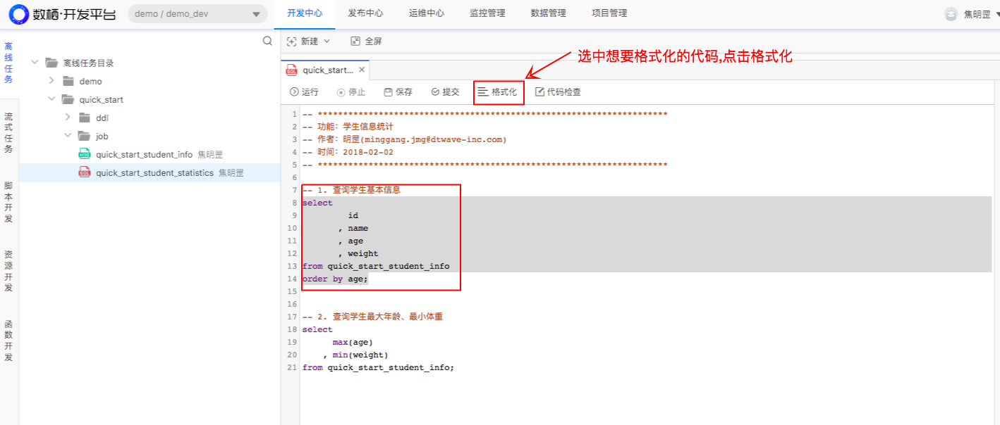<center>图 4-1-1-7 格式化语句</center>

###### 4.1.1.5 代码检查

选中需要检查语句，点击**代码检查**，进行语法校验，目前只支持sql语法校验，如图4-1-1-8所示：

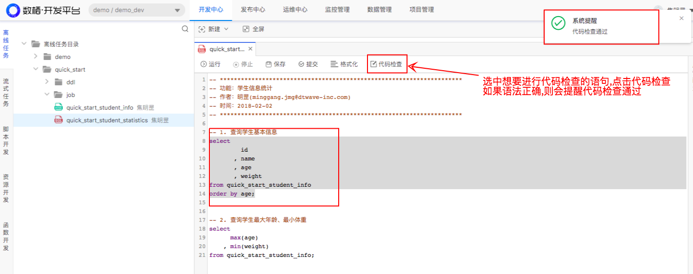<center>图 4-1-1-8 代码检查</center>

###### 4.1.1.6 运行

直接点击运行按钮即会运行任务所有代码。当需要运行某一语句时，选中要执行的语句，再点击**运行**即可。如图4-1-1-9所示：

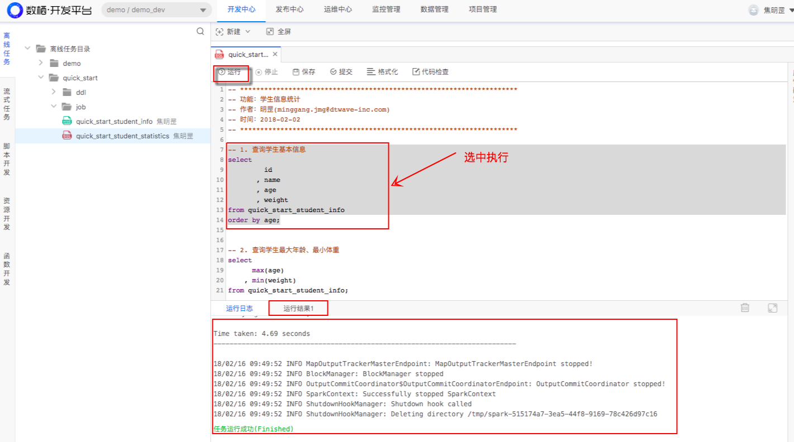 <center>图 4-1-1-9 运行</center>

###### 4.1.1.7 提交

任务在开发环境完成测试以后，可以发布到生产环境，点击提交后在**发布中心**的**创建发布包**页面会有一条记录待发布。如图4-1-1-10 所示：

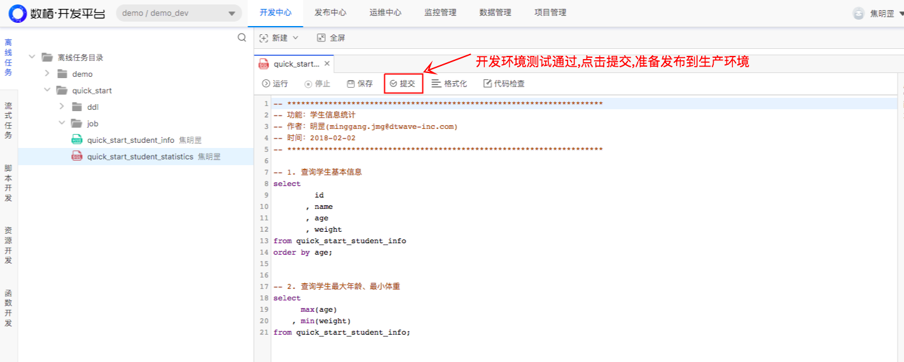<center>图 4-1-1-10 提交任务</center>

##### 4.1.2 属性配置

###### 4.1.2.1 运行参数 

- 用户自定义参数

  参数左侧是key或变量名，右侧是value或变量值，使用时在语句中是${变量名}，如图4-1-2-1所示：

  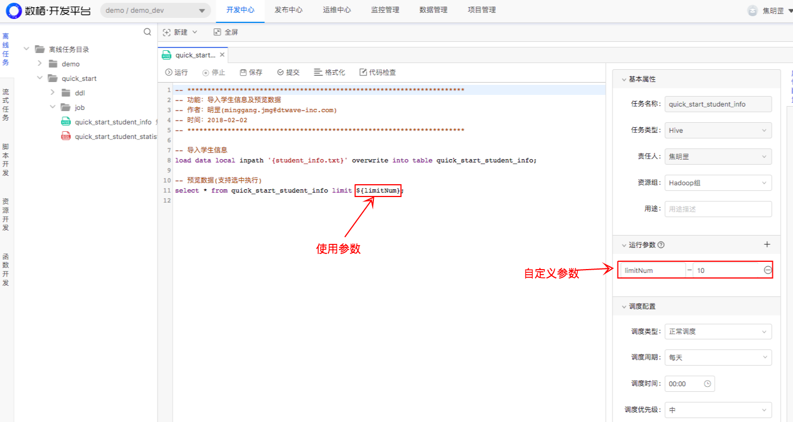<center>图4-1-2-1 用户自定义参数</center>

- 系统参数

  系统参数为系统默认的系统变量，目前支持变量"bizDate"，${bizdate}格式 yyyymmdd，日常调度实例定时时间的前一天（年月日）。节点每天自动调度实例定时时间年月日减 1 天。系统参数使用和自定义参数相同，只是系统变量值每天不同。例如：今天日期为“2018-02-21”，则bizDate=‘20180220’。

###### 4.1.2.2 调度配置

- 正常调度

  正常调度为每天调度，调度时间即任务开始运行时间，配置原则通常为集群常规空闲时间，一般为凌晨2点到早晨8点。

  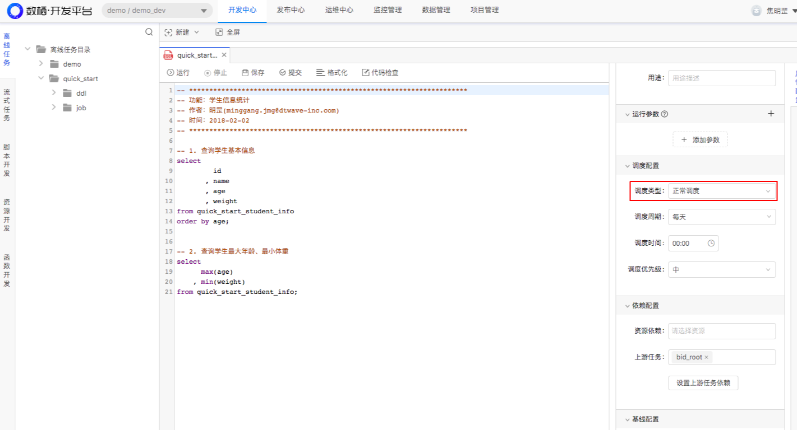<center>图 4-1-2-2 正常调度</center>

- 跨周期调度

  如果周期设置为每周，可以选择每周的具体某天运行任务；如果选择每月，可以理选择每月的具体某一号运行任务。如图4-1-2-3 所示：

  <center>图 4-1-2-3 跨周期调度</center>

- 暂停调度

  暂停调度即线上环境任务不触发周期调度。配置如图4-1-2-4 所示：

  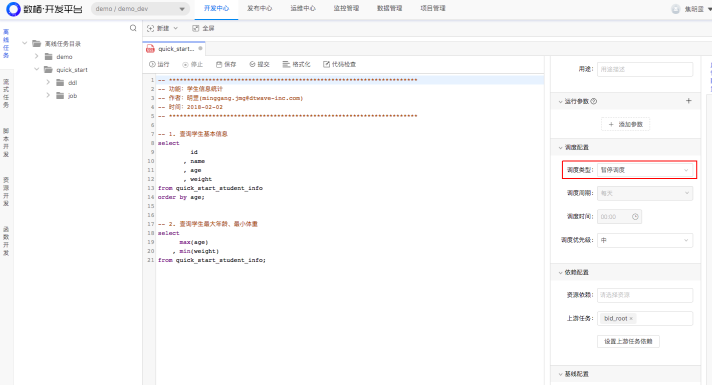<center>图 4-1-2-4 暂停调度</center>


###### 4.1.2.3 依赖配置

资源依赖、任务依赖配置如图4-1-2-5 所示：

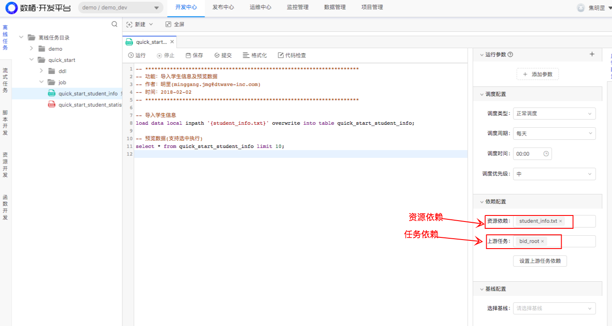<center>图 4-1-2-5 依赖配置</center>

###### 4.1.2.4 基线配置

通过配置基线监控任务截止到具体某个时刻是否还在运行，对仍在运行的任务进行告警。配置如图4-1-2-6 所示：

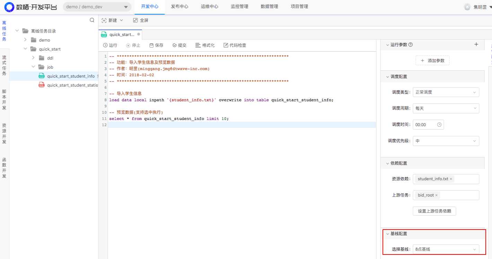<center>图 4-1-2-6 基线配置</center>

###### 4.1.2.5 资源组配置

任务可以配置到某个资源组中运行，配置如图4-1-2-7 所示：

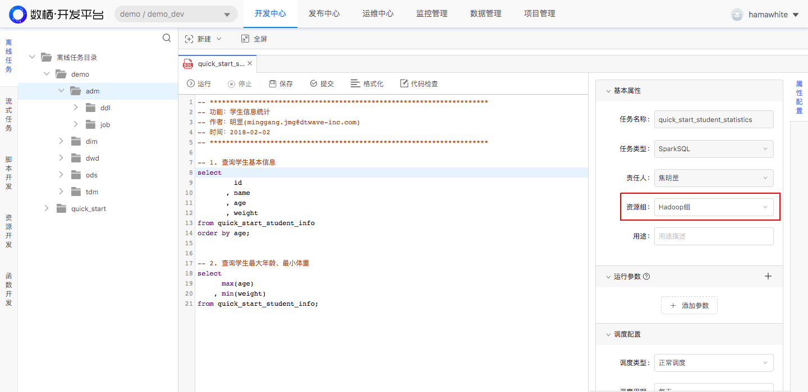<center>图 4-1-2-7 资源组配置</center>

##### 4.1.3 任务类型
###### 4.1.3.1 Shell
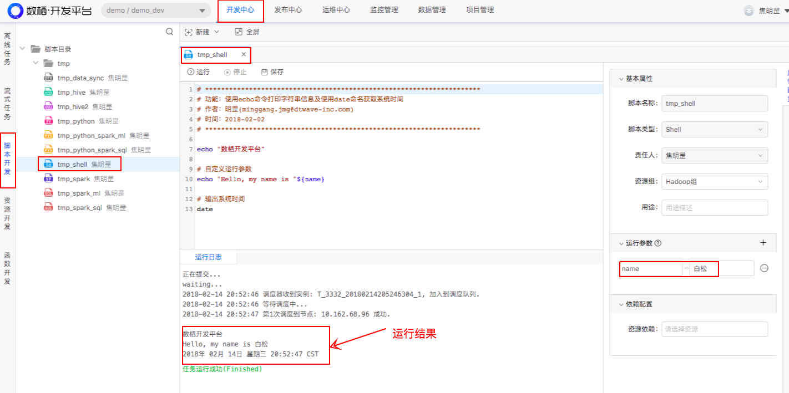<center>图 4-1-3-1 Shell任务</center>

###### 4.1.3.2 DataSync

<center>图 4-1-3-2 DataSync任务</center>

###### 4.1.3.3 Hive

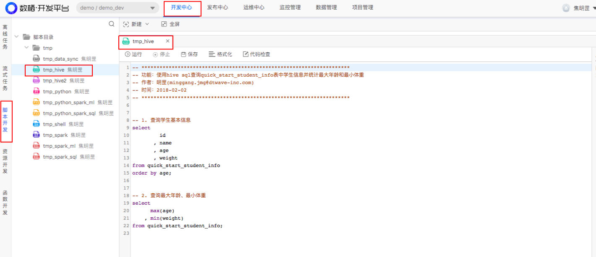<center>图 4-1-3-3 Hive任务</center>

###### 4.1.3.4 SparkSQL

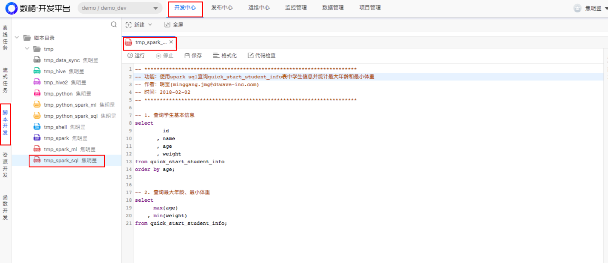<center>图 4-1-3-4 SparkSql任务</center>

###### 4.1.3.5 Python

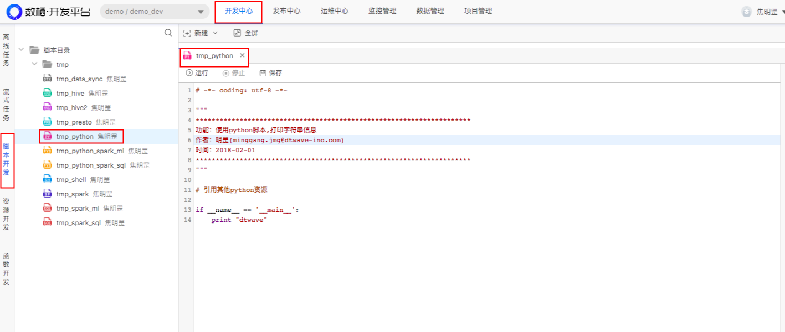<center>图 4-1-3-5 Python任务</center>

###### 4.1.3.6 PySpark

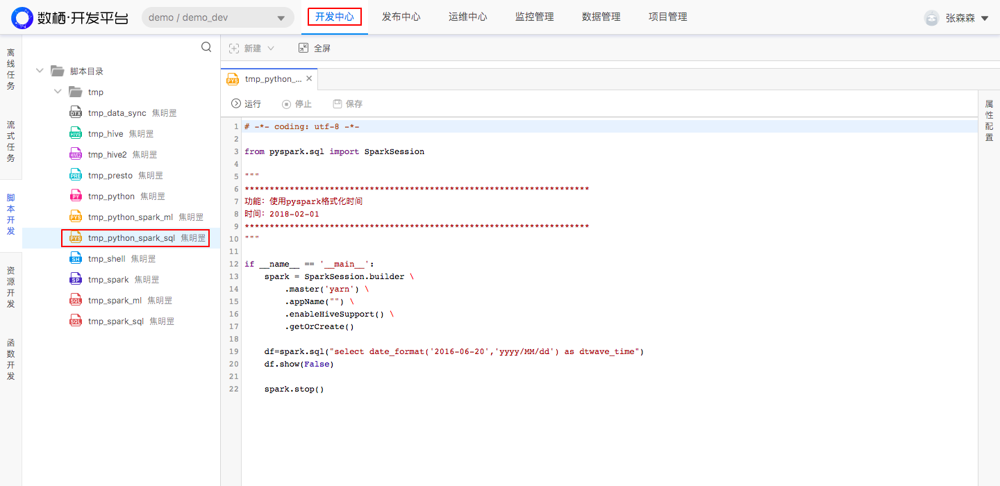<center>图 4-1-3-6 PySpark任务</center>

###### 4.1.3.7 Spark

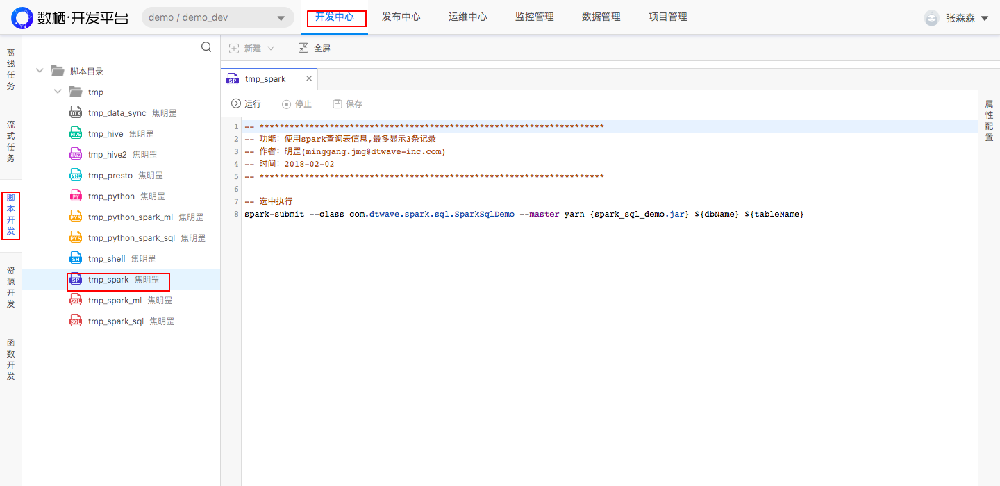<center>图 4-1-3-7 Spark任务</center>

###### 4.1.3.8 Hive2

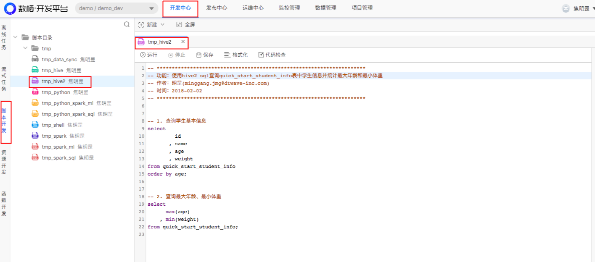<center>图 4-1-3-8 Hive2任务</center>

###### 4.1.3.9 Presto

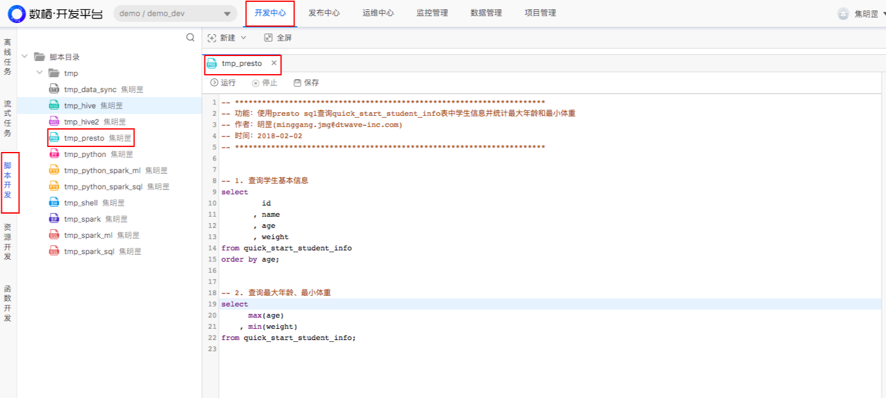<center>图 4-1-3-9 Presto任务</center>

###### 4.1.3.10 FlinkSQL

###### 4.1.3.11 Flink

#### 4.2 发布中心
在开发平台中，每个项目空间分为多个环境，如开发环境和生产环境，每个环境中的文件，数据，配置等都是隔离的，开发环境进行代码开发和调试，在发布中心经过发布流程后任务、资源和函数的变更才能进入生产环境。

##### 4.2.1 创建发布包

提交任务以后，在**发布中心**的**创建发布包**页面下，选中将要发布的任务，点击右侧**创建发布包**，在弹框中自定义发布包名称，输入发布包描述，点击**确定**，完成创建发布包。如图4-2-1、4-2-2所示：

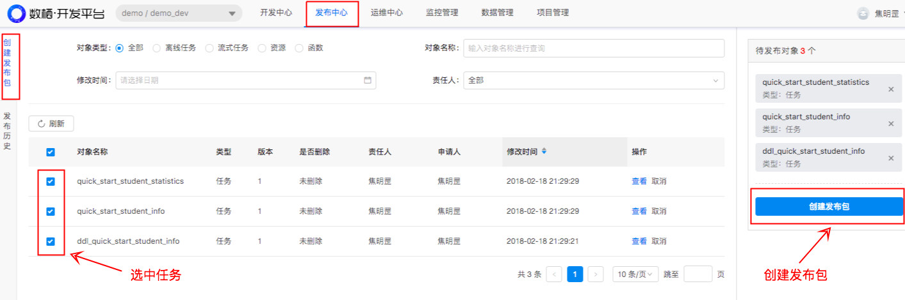<center>图 4-2-1 创建发布包 </center>

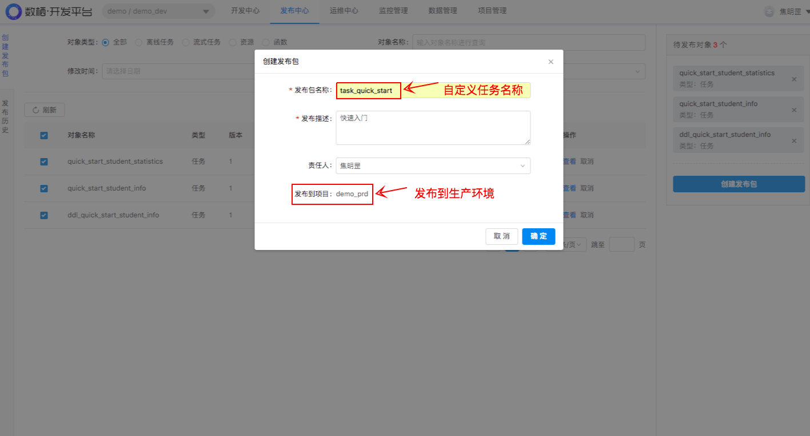<center>图 4-2-2 创建发布包 </center>

##### 4.2.2 发布历史

- 查看

  查看发布包详情等信息，如图4-2-3 所示：

  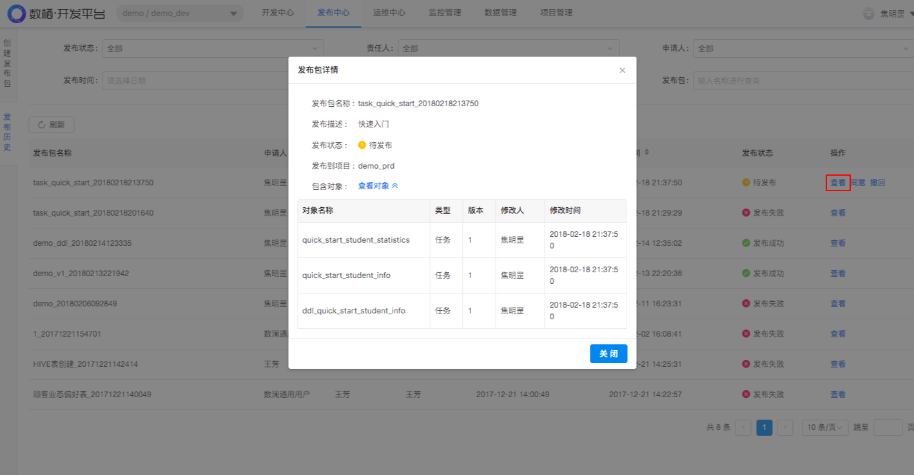<center>图 4-2-3 查看发布包</center>

- 发布

  发布到生产环境，任务将周期调度执行，只有管理员和运维角色有发布权限。如图4-2-4 所示：

  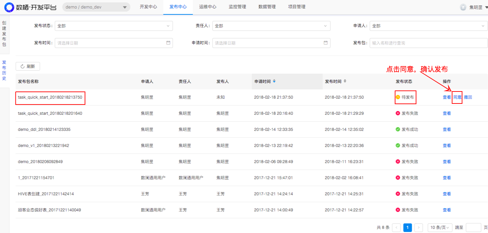<center>图 4-2-4 发布</center>

- 撤销

  撤销发布，撤销发布以后，任务重回到**创建发布包**页面下。，如图4-2-5所示：

  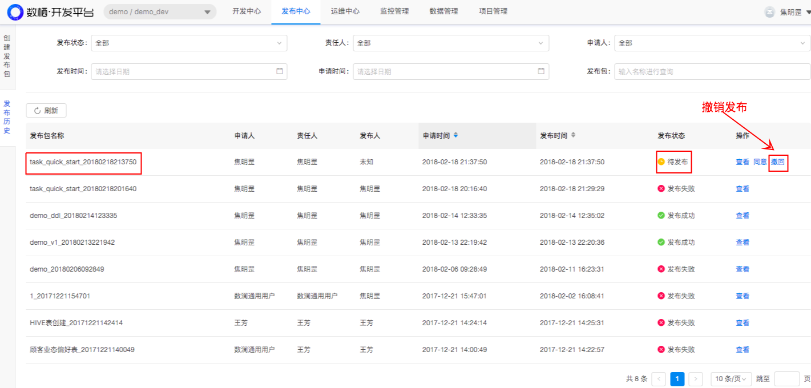<center>图 4-2-5 撤销发布包</center>

#### 4.3 运维中心
##### 4.3.1 运行总览

运行总览页可以查看离线任务、流式任务的统计信息，包含运行总任务数、当前时间任务运行数、已完成的任务数、待运行任务数、失败任务数等信息，点击任务数模块可以直接进入到实例详情页面，查看任务详情信息。运行总览页离线任务信息任务如下图 4-3-1所示：

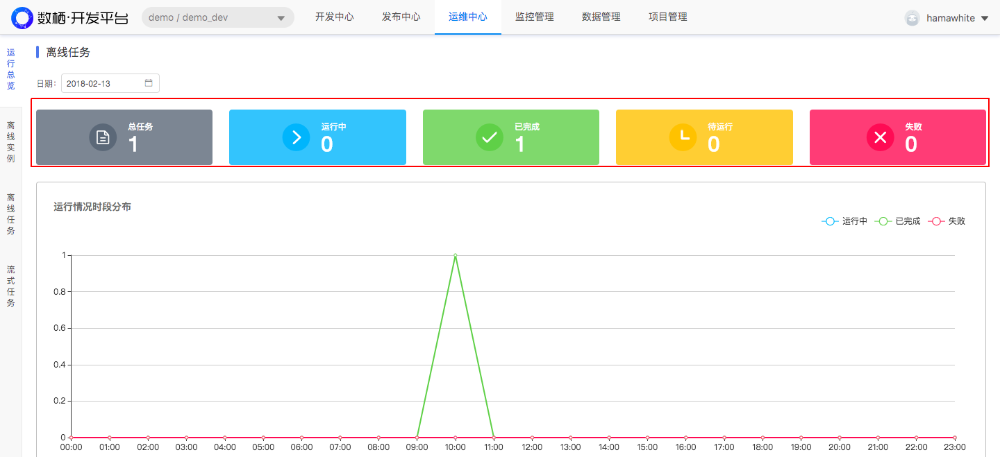<center>图4-3-1 离线任务总览</center>

运行总览页流式任务信息如下图 4-3-2所示：

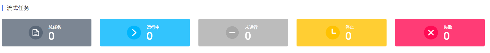<center>图4-3-2 流式任务总览</center>

##### 4.3.2 离线实例

离线实例页面分为两块内容，左侧为离线任务实例列表，可以根据日期、状态、负责人、名称进行筛选；右侧为具体任务实例信息，包含实例上下游依赖、实例运行状态、实例基本信息等，右击任务实例，可以看到实例操作列表，包含展开父节点、展开子节点、查看运行日志、查看代码、终止、重跑、重跑下游、置成功。

离线实例页如下图4-3-3 所示：

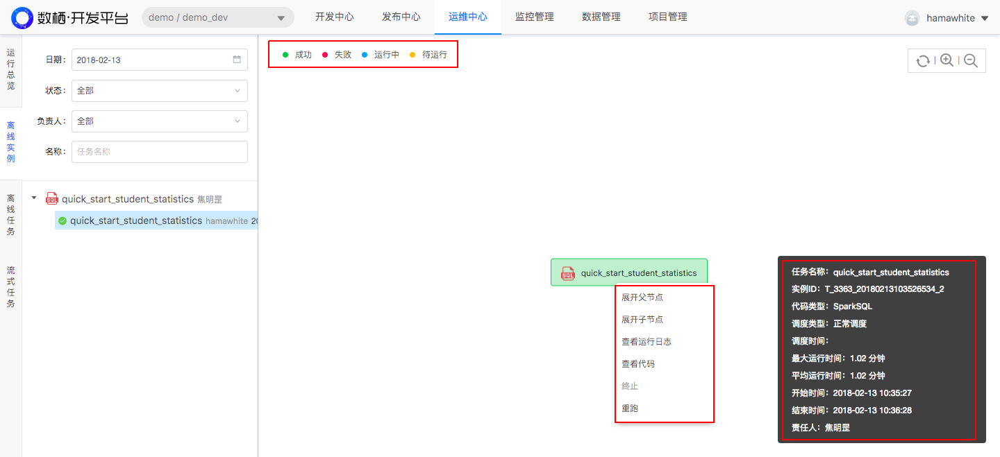<center>图4-3-3 离线实例页</center>

###### 4.3.2.1 展开父节点

点击任务实例，右击可以看到功能操作列表，点击展开父节点，在实例上方即可看到任务实例父节点信息。

###### 4.3.2.2 展开子节点

点击任务实例，右击可以看到功能操作列表，点击展开子节点，在实例下方即可看到任务实例子节点信息。

###### 4.3.2.3 查看运行日志

点击任务实例，右击可以看到功能操作列表，点击查看运行日志，弹出运行日志窗口，查看实例运行日志。

运行日志页如下图4-3-4 所示：

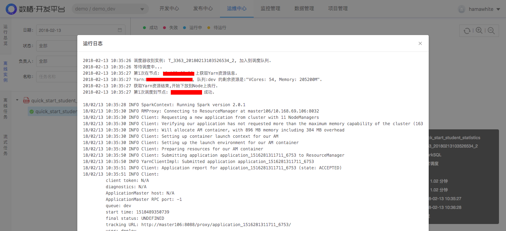<center>图4-3-4 任务日志页</center>

###### 4.3.2.4 查看代码

点击任务实例，右击可以看到功能操作列表，点击查看代码，弹出任务代码窗口，查看实例运行真实代码。

任务代码页如下图4-3-5 所示：

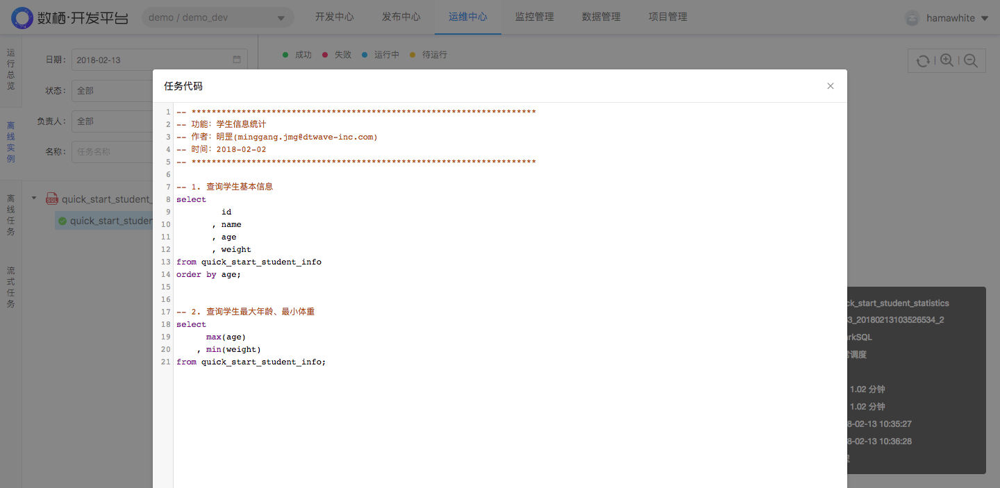<center>图4-3-5 任务代码页</center>

###### 4.3.2.5 终止

只可对等待运行、运行中状态的实例进行终止运行操作，进行此操作后，该实例将为失败状态。

###### 4.3.2.6 重跑

任务实例重跑即实例重新运行一遍，当任务状态处于成功、失败时可以进行重跑，可以点击查看运行日志操作查看重跑实例的运行日志。

###### 4.3.2.7 重跑下游

任务实例重跑下游即实例和所有下游节点都重新运行一遍，当任务状态处于成功、失败时，以及当前环境处于生产(prd)环境时可以进行重跑下游，当前任务状态会处于待运行或运行中状态，下游任务等父节点运行完成再运行。

###### 4.3.2.8 置成功

将当前节点状态改为成功，并运行下游未运行状态的任务，当任务状态处于失败时，并且当前环境处于生产(prd)环境时可以进行置成功操作。

##### 4.3.3 离线任务

离线任务页面分为两块内容，左侧为离线任务列表，可以根据任务名称进行筛选；右侧为具体任务信息，包含任务上下游依赖、任务基本信息等。

###### 4.3.3.1 补数据

补数据就是对工作流/任务执行发生在过去的一段时间的调度，执行补数据后根据补数据的时间范围和任务调度周期自动生成相应个数的实例，按照时间顺序从早到晚依次运行。

补数据操作页如下图4-3-6 所示：

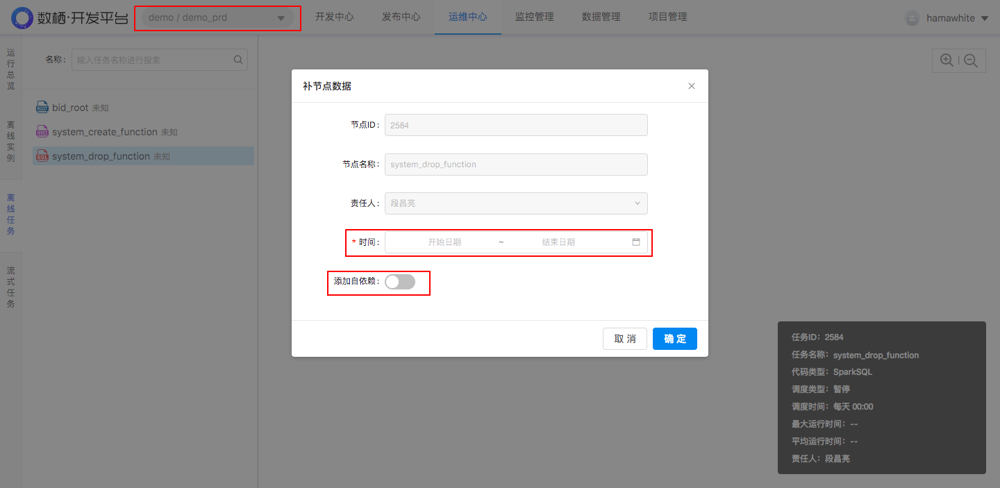<center>图4-3-6 补数据操作页</center>

- 自依赖

  如果是连续补好几天的补数据任务，选择自依赖后，实例之间产生了依赖关系，在第一天有一个任务实例失败了，那么第二天的任务实例也不会开始运行。
###### 4.3.3.2 补下游

生产环境下周期任务才可以进行补下游操作，即补该任务及其下游任务。

##### 4.3.4 流式任务

流式任务页面中可以根据启动时间、状态、责任人、名称进行筛选任务，还可以对流式任务进行启动、查看日志等操作。

流式任务页如下图4-3-7 所示：

<center>图4-3-7 流式任务页</center>

#### 4.4 监控管理

##### 4.4.1 基线管理

在基线管理中可以设置任务的预期完成时间、任务的优先级和管理任务的告警策略。同时通过自研的基线监控技术能实时监控任务的运行情况，并且能预测任务的完成时间，提前预警，大大减少了数据处理的故障率。
在任务的属性中，可以给任务设置关联的基线，任务运行中触发了关联基线后则依据基线的告警规则告知责任人。
基线的告警记录中保留了所有触发了告警的记录，相关责任人处理了告警的任务后，可以把状态设置为置为已处理。基线管理中可以新增基线、编辑基线、删除基线和基线列表查询等。
示例：任务的基线配置

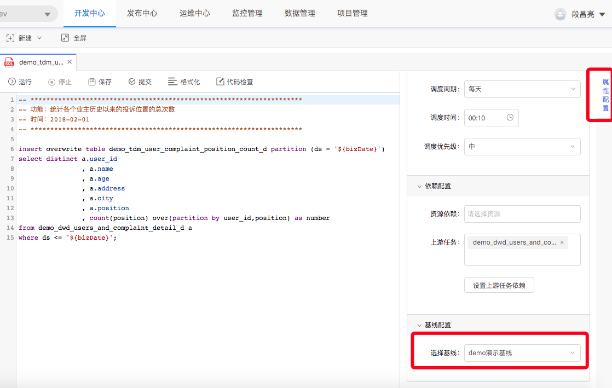<center>图4-4-1 任务的基线配置</center>

###### 4.4.1.1 新建基线

1）进入监控管理界面—基线管理界面，点击“新增基线”，进入到新增基线界面。

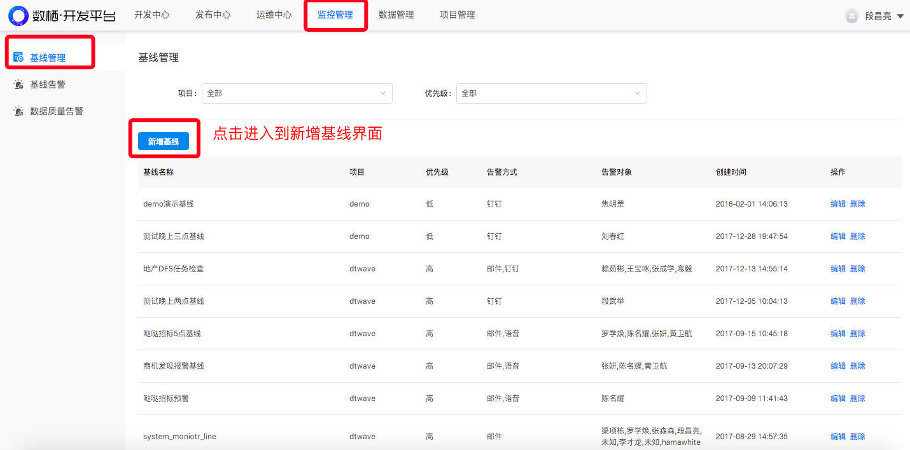<center>图4-4-2 新增基线入口</center>

2）填写以下相应的信息，“*”表示填项，下拉框如果不选，则为默认。

<center>图4-4-3 新增基线</center>

3）点击确定，出现系统提示“操作成功”，即新建基线成功。

###### 4.4.1.2 编辑基线

1）新建基线成功后，可在基线管理主界面到所有的基线列表，选择某一个基线，在操作栏中点击“编辑”。

2）进入到基线编辑界面（与新增基线界面一致），除了项目不可修改之外，其它的都可修改。

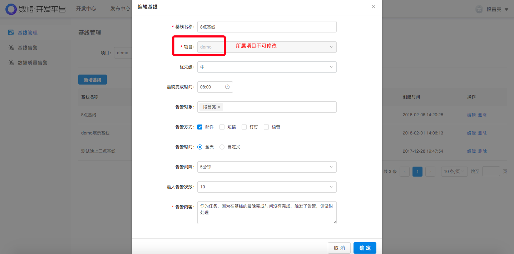<center>图4-4-4 编辑基线</center>

3）点击“确定”按钮，出现系统提示“操作成功”，即编辑成功。

###### 4.4.1.3 删除基线

1）基线管理主界面，基线列表中，选择某个基线，在操作栏下点击“删除”。

2）弹出删除确认框，点击“确定”。

3）出现系统提示“操作成功”，即删除成功。

##### 4.4.2 基线告警

基线告警中以列表的形式记录了所有已触发的告警，可通过项目、处理状态、告警方式、告警基线和告警时间等筛选出所要过滤的告警记录。对于相关负责人处理告警任务后，可手动把状态设置为“置为已处理”。

1）单个“置为已处理”，选择某个未处理的告警记录，在操作栏中点击“置为已处理”。此时告警记录的状态变为“已处理”状态。

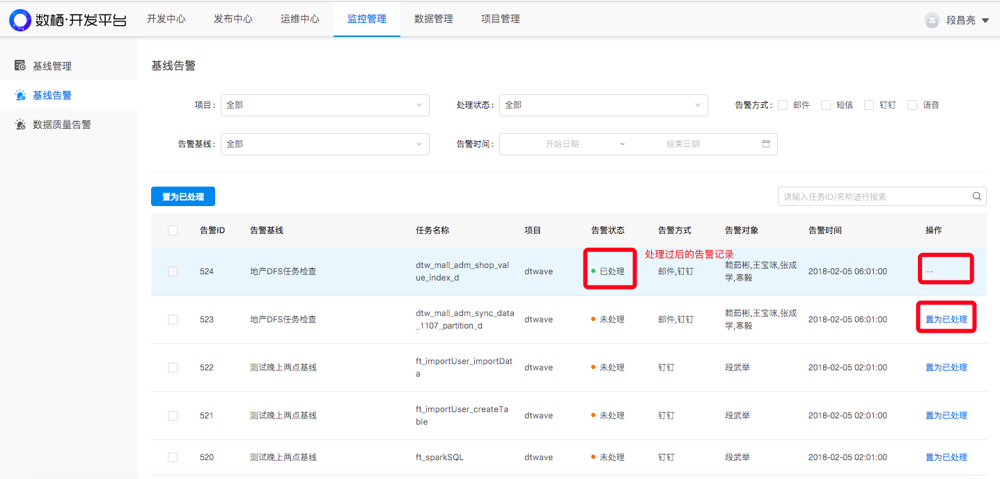<center>图4-4-5 基线告警记录处理</center>

2）批量“置为已处理”，把列表菜单栏中的告警ID前面的方框“勾上”，此时本页中的所有未处理的告警记录都为选中状态，点击列表上方的“置为已处理”按钮。

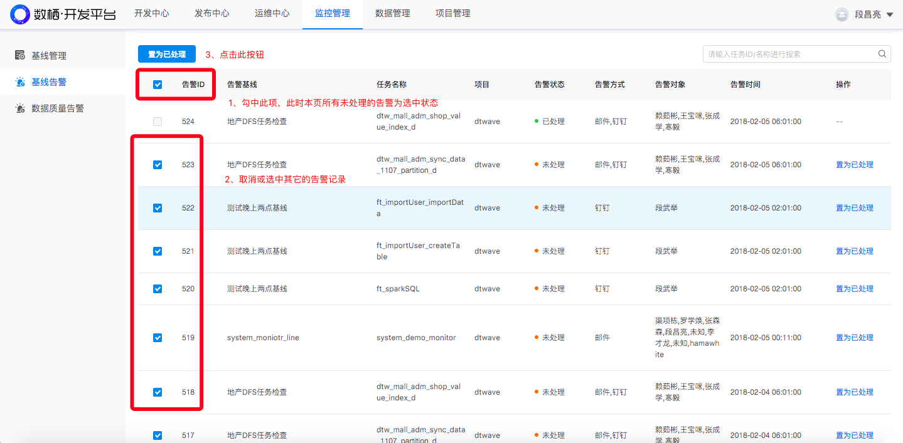<center>图4-4-5 基线告警记录批量处理</center>

##### 4.4.3 数据质量告警

数据质量告警中以列表的形式记录了所有已触发的告警，可通过项目、处理状态、告警方式、告警对象和告警时间等筛选出所要过滤的告警记录。对于相关负责人处理告警任务后，可手动把状态设置为“置为已处理”。

数据质量告警页如下图4-4-6 所示：

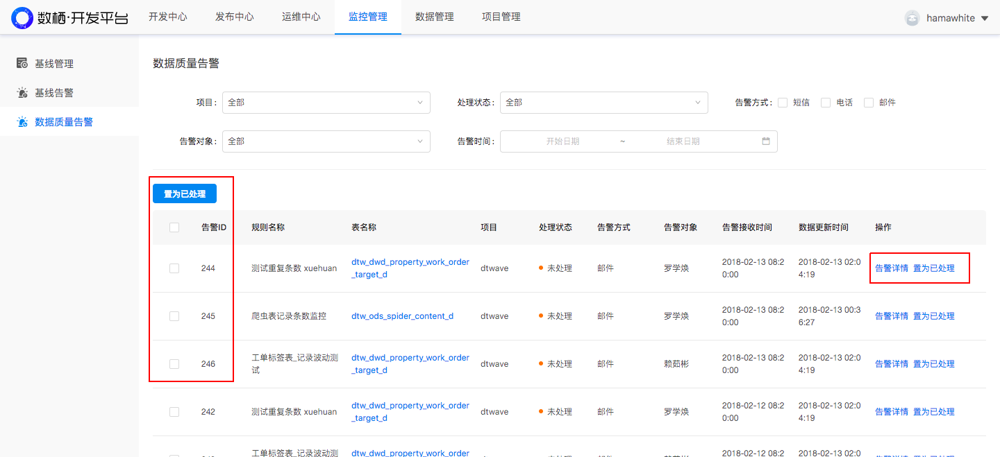 <center>图4-4-6 数据质量页</center>

#### 4.5 数据管理

​	数据管理是数栖平台提供的大数据管理平台工具，可以查看大数据系统中的元数据信息、数据表的上下游血缘关系、设置表的生命周期，对数据表的新增记录数、字段值等进行监控和相应的告警策略配置，还可进行数据目录和术语项的管理。目前已集成于数栖研发平台中，通过系统间的有序配合，实现了对数据的资产化管理。主要包括全局概览、元数据管理、数据质量、数据目录、术语项管理等功能模块。

##### 4.5.1 全局概览

​	全局概览展示了租户下数据库数、表个数和表存储量等信息，主要包含三个部分：

​	1）元数据：用户下的核心指标，包含该租户下的数据库总数、表的总数、所有库总存储量三个指标。

​	2）数据质量(今日)：已监控表数目、配置规则数目、告警规则数目及正常规则数目，并和昨天同期进行一个对比。

​	3）数据库表：使用情况排行榜，包含如下信息：

​	【项目存储量Top 10】：表示数据库占用的数据总存储量的排名前十位，同时包含生产和开发数据库。

​	【表存储量Top 10】：表示所有库中表的存储量的排名前十位，目前该统计数据的信息是截止到当日凌晨0点的存储量。

​	【昨日表新增存储量Top 10】：表示所有库中表的新增存储量的排名前十位，统计的信息是昨天一天的新增量。

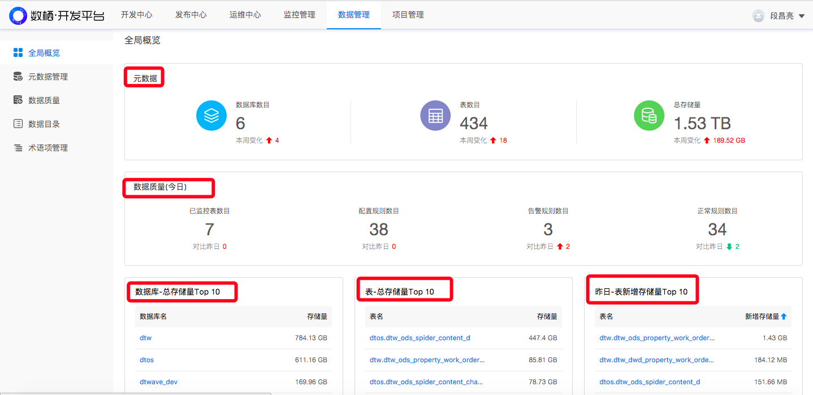 <center>图4-5-1 全局概览</center>

##### 4.5.2 元数据管理

​	元数据管理中以列表形式展示当前用户下所拥有的表和所属项目空间下的表。可以查看到表的详细信息。

1）元数据主界面中可通过数据库、类目、表名称、字段名称和字段描述信息等来过滤出相应的数据表。

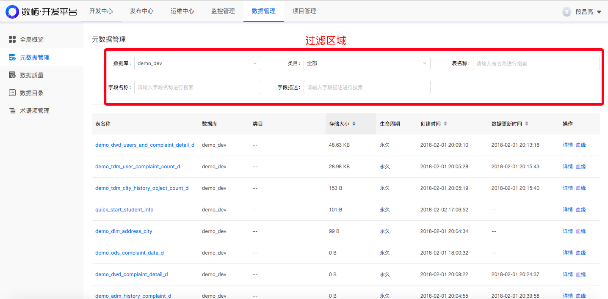<center>图4-5-2 元数据管理界面</center>

2）元数据管理表详情，点击表“详情”进入到表的详细信息界面主要包括以下信息：

- 基本信息：主要包括中文名、表创建时间、DDL更新时间、数据更新时间、所属类目和描述等。
- 存储信息：主要包括总存储量、昨日新增量、生命周期、存储方式等。

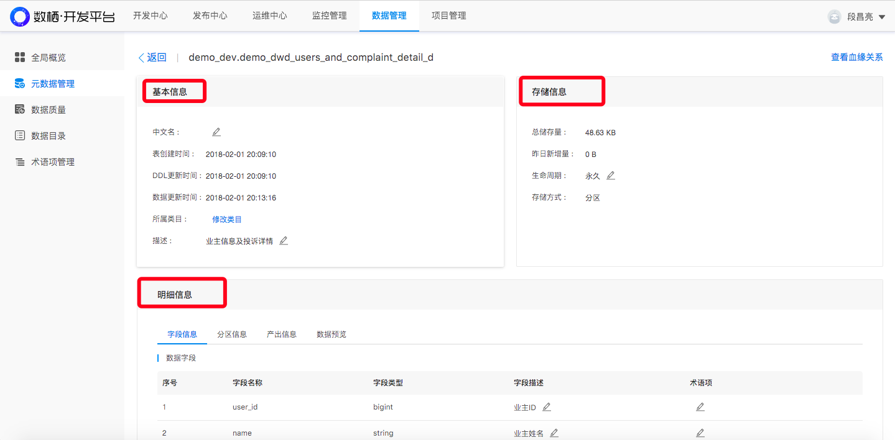<center>图4-5-3 元数据表详细信息</center>

- 明细信息：主要包括字段信息、分区信息、产出信息、数据预览等

  【字段信息】展示该表的数据字段和分区字段的名称、类型和描述信息。

  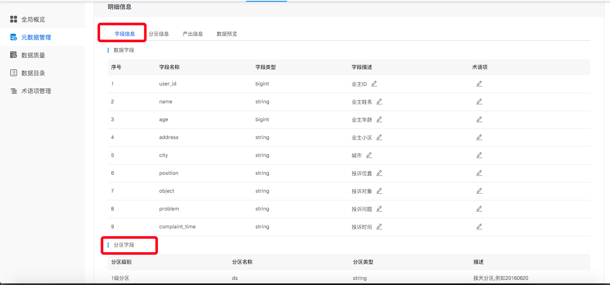<center>图4-5-4 元数据表明细信息--字段信息</center>

  【分区信息】展示该表的分区信息，按照创建时间倒序展示表的所有分区信息

  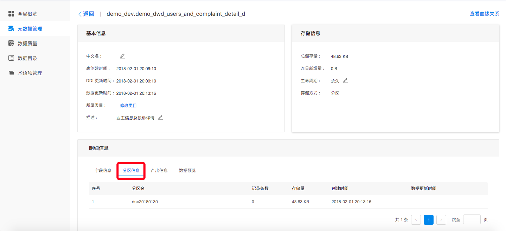<center>图4-5-5 元数据表分区明细信息--分区信息</center>

  【产出信息】展现该表最近7个相关执行周期中新增加的记录条数，hover上去会自动显示记录数。

  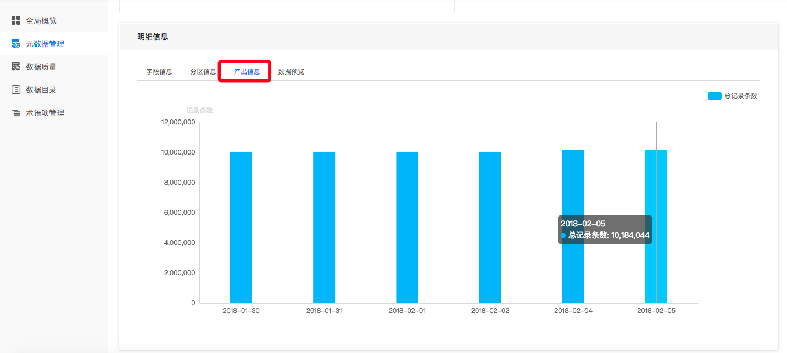<center>图4-5-6 元数据表分区明细信息--产出信息</center>

  【数据预览】预览该表的10条记录

  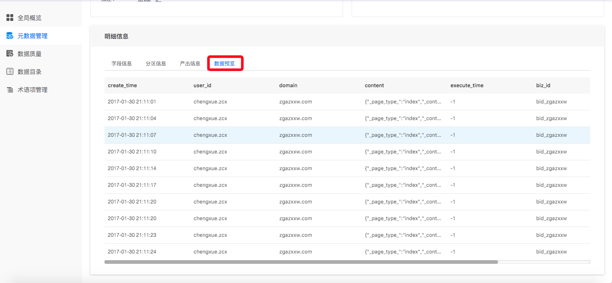<center>图4-5-7 元数据表分区明细信息--数据预览</center>


###### 4.5.2.1 生命周期

数据表的生命周期指的是分区表数据的有效期；如A分区表生命周期为7天，指的是该表分区数据存储时间只有7天，7天过后会该分区数据被自动删除。在表的存储信息中可设置生命周期：7天、30天、366天、永久，默认为永久。

1）元数据管理数据列表界面，点击表的详情进入到元数据表详细信息界面，点击存储信息中的生命周期的修改按钮。

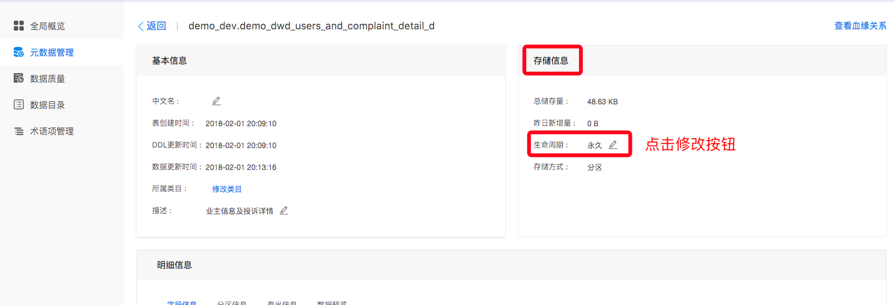<center>图4-5-8 元数据表生命周期设置</center>

2）出现生命周期选择下拉框，选择需要的周期，点击“确定”按钮；出现系统提示“操作成功”，即设置成功。

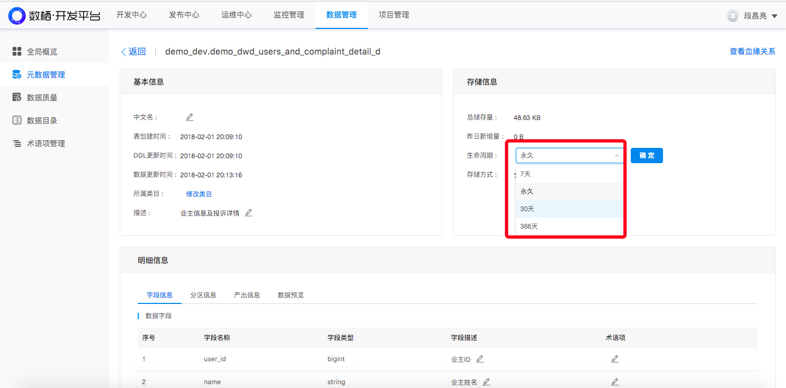<center>图4-5-8 元数据表生命周期设置</center>

###### 4.5.2.2 数据血缘

数据血缘关系以历史事实的方式记录每项数据的来源，处理过程等，记录了数据表在治理过程中的全链血缘关系；基于这些血缘关系信息，可以轻松的进行数据分析，以数据流向为主线的血缘追溯等功能。

血缘信息展示可以从任意一张表出发，向上追溯到数据的源头，可以向下追溯到依赖该表数据的最新产出的表的信息。并且中间任何一张表可以继续展开产出表和依赖表的信息。表层次展示可以展示当前选择表的如下信息：

​	a.直接上游表的个数和直接下游表的个数

​	b.从源头开始的所有上游关系最大层次和昨天最新更新的下游表的最大层次

​	c.所有和表有血缘关联的上游表个数和昨天最新更新的下游表个数

表血缘信息如下图4-5-9 所示：

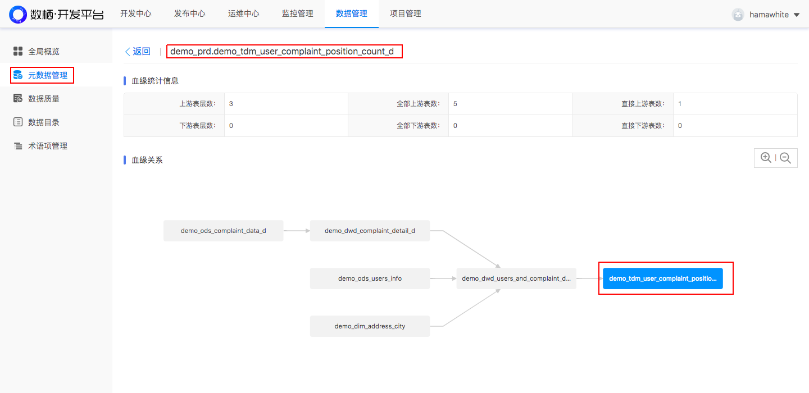<center>图4-5-9 表血缘信息</center>

##### 4.5.3 数据质量

​	数据质量主要是对分区表数据的准确性和数据量进行校验，按照通用和自定义的规则进行校验和检查，并有可视化的工具对问题数据和任务进行记录和展示。

​	数据质量主界面主要显示所有的项目空间下的分区数据表，通过数据库，规则，状态和表名称可过滤出相应的数据表。数据表列表中可查看表名称，表的数据库，表配置的监控类型，监控状态，告警方式，数据更新时间和操作等对于未配置规则的数据可直接在操作栏中“配置规则”，对于已配置规则的数据表可进行查看质量报告，订阅报告和查看规则。

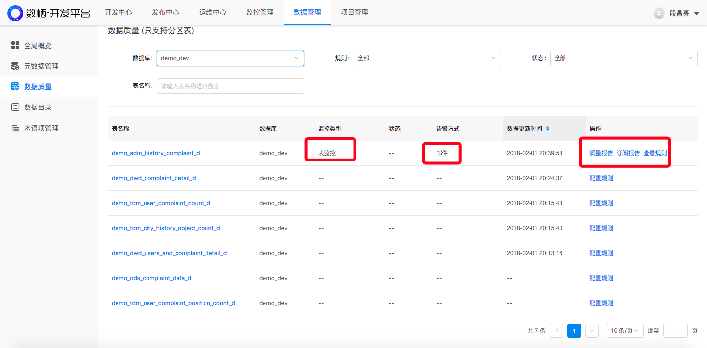

- 监控配置主要包括表维度的监控和字段维度的监控

  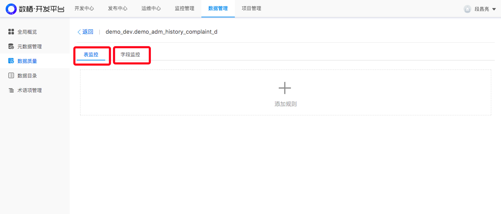

  1）表级监控：主要包括记录波动、每日新增存储量和总存储量。

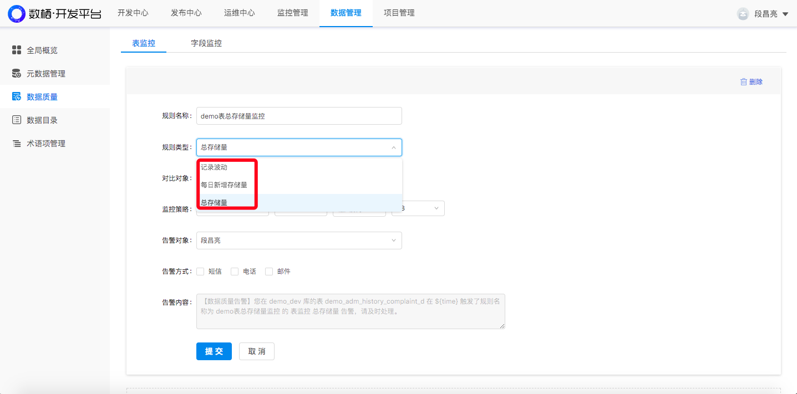

配置项说明：

​	a.【规则类型】选择“记录波动”和“每日新增存储量”时则【对比对象】可以选择“前1天”，“上1工作日”，“上周同期”，“最近7日平均”，“最近30天平均”，“固定值”。

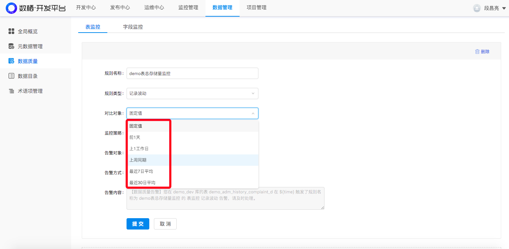

​	b.【规则类型】选择“总存储量”时【对比对象】默认为“固定值”。

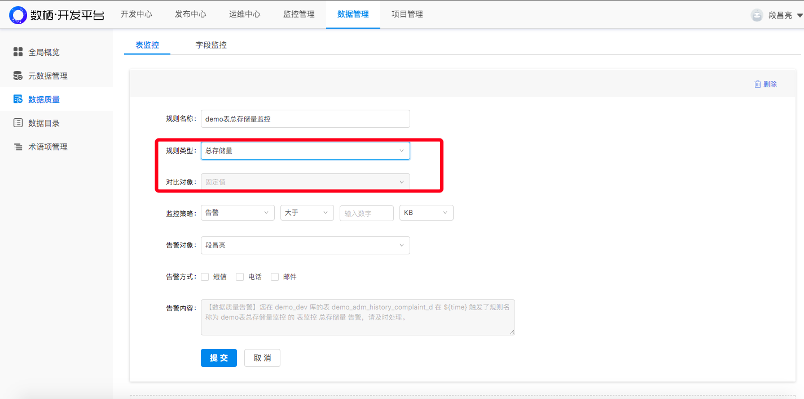

​	c.【监控策略】告警趋势值包括“绝对值”、“上升”、“下降”3种，比较方式包括“大于”、“小于”、“介于”、“等于”、“不等于”5种；而当【对比对象】为“固定值”时，比较方式只有“大于”、“小于”、“等于”3种。

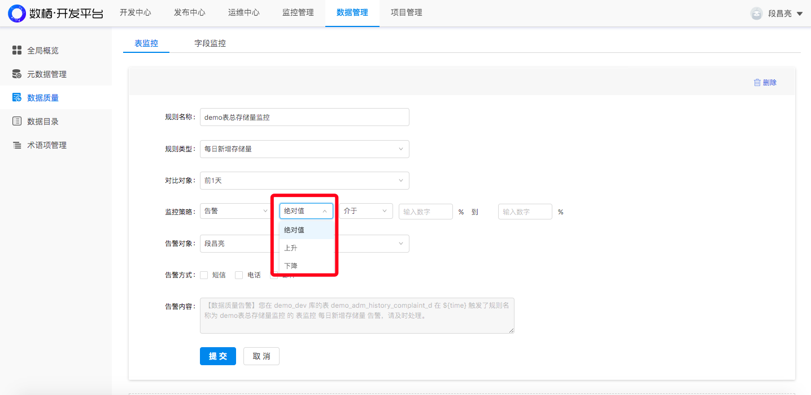

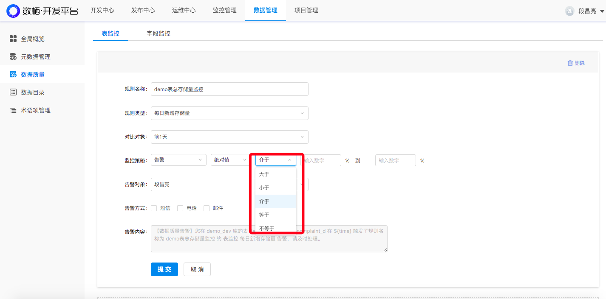

​	d.【告警对象】下拉框，列出项目中所有成员，只能选择一个。

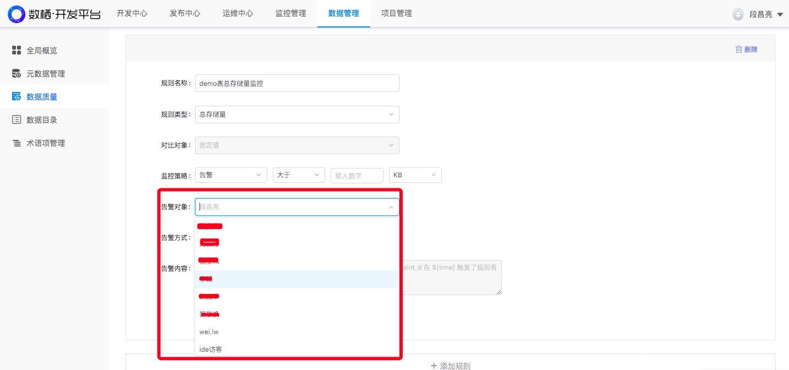

​	e.【告警方式】支持“短信”、“电话”、“邮件”3种试，可多选

​	f.【告警内容】默认为模板，且不可修改。

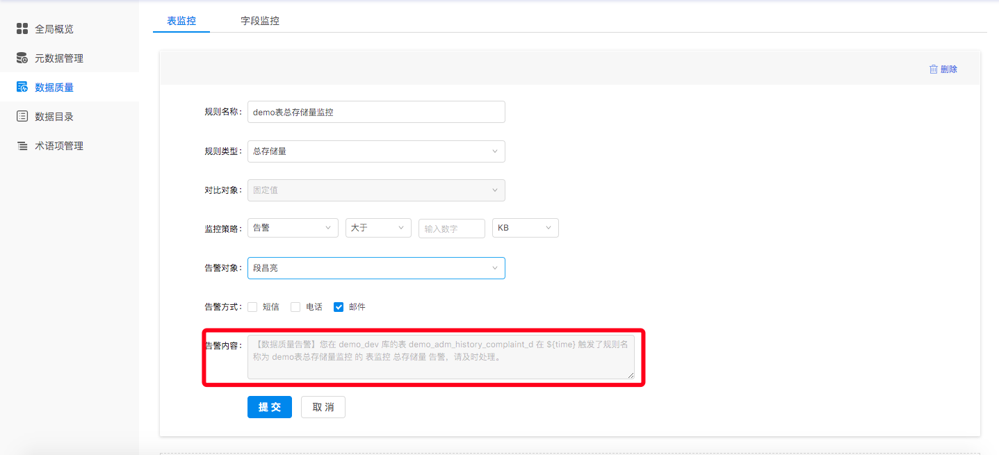

2）字段级监控：主要包括字段规范性和字段值2种

​	a.【规则类型】为字段规范性时，【监控类型】分为“是否唯一”，“是否为空”，“为否规范”3种

​	b.【规则类型】为字段值时，【监控类型】则分为“平均值”，“最大值”，“最小值”，“总和”，“方差”等5种

​	c.【监控策略】告警趋势值包括“绝对值”、“上升”、“下降”3种，比较方式包括“大于”、“小于”、“介于”、“等于”、“不等于”5种；而当【对比对象】为“固定值”时，比较方式只有“大于”、“小于”、“等于”3种。

​	d.【告警对象】下拉框，列出项目中所有成员，只能选择一个。

​	e.【告警方式】支持“短信”、“电话”、“邮件”3种试，可多选

​	f.【告警内容】默认为模板，且不可修改。

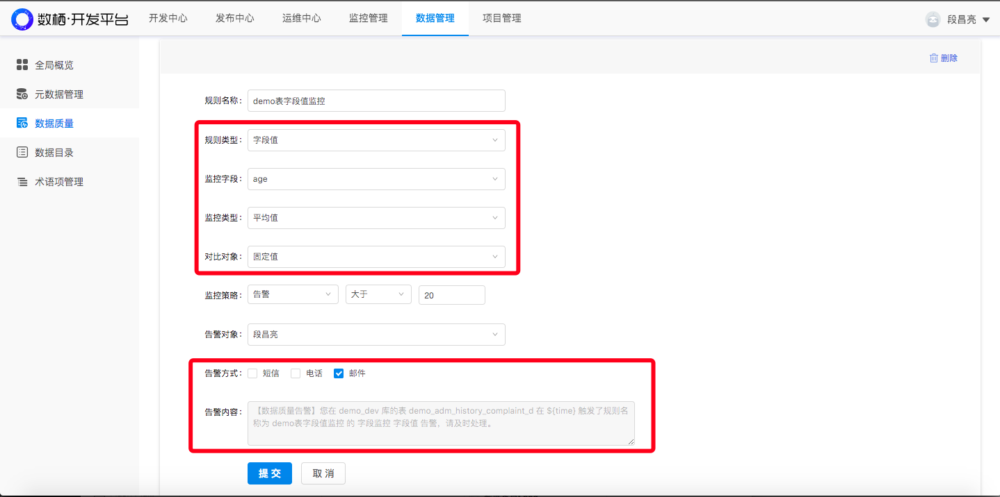

- 规则新建和编辑

  1）进入数据质量主界面，在数据表列表中选择某一个表，在操作栏点击"配置规则（未配置规则）"和"查看规则（已配置规则）”。

  2）在“表监控”或“字段监控”（两种监控新建方式一样，以下以表监控创建为例），点击“+ 添加规则”按钮（只有研发平台管理员帐户才可新增）。

  3）进入到规则新增（编辑）界面，填写相应值，值的规范请参照上面配置项说明。


- 数据质量报告

  配置规则好之后，可以查看每天的数据质量报告；数据质量报告中可以查看到表的基本信息（表名，所属项目，分区信息，创建时间和数据更新时间）、规则的状态分布（正常，告警，暂无数据）、监控情况（规则名称，监控类型，最新状态，告警对象）、指标监控报告（各类的规则监控记录波动线形图）可根据某个监控进行具体查看配置等。

  质量报告支持订阅定制，也可通过邮件、短信等形式定期发送给相关责任人


##### 4.5.4 数据目录

​	提供简单易用的工具构造完整的术语表，以树形层次逻辑结构对术语进行分类管理，可以根据用户标准和惯例将术语项与数据资产关联，为分析员提供与该术语项关联的正确数据来源，并且可以将特定的用户或用户组指定为术语项、类别或其他资产的管理员，从而负责特定资产的定义、使用和管理。

​	通过可视化的界面实现数据和标签的分类和展示，可以根据实际的场景需要实现数据的规范化标准化，主要功能包括：数据类目和标签类目。

###### 4.5.4.1 数据类目

​	用户（只有管理员有权限）可以自定义数据目录结构和类目体系，包括如下功能：

1）数据类目设置

​	a.   类目导航和层级设置，可以根据实际的数据主题，自定义数据类目名称和层级结构

​	b.   类目搜索，根据名称快速定位到需要寻找或修改的类目。

2）数据类目查看

​	根据设置的数据类目结构，显示数据类目结构图，并且支持根据类目名称快速定位到需要查找的类目。选择对应的三级类目之后可以展示该类目下的字段信息。

3）数据类目新建

​	a.  进入到数据类目--数据类目界面，在“数据类目”右键点击添加子类目。

​	b.  子类目自定义取名，在此子类目上右键点击“添加子类目”，以此类推，一直添加3个层级（从开始自定义添加的为第1层级）。

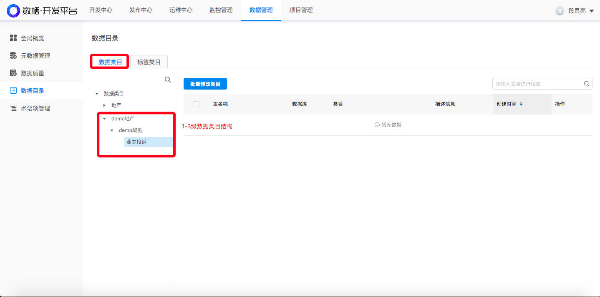

​	c.  类目结构新建完成之后，进入到元数据管理界面，选择所要关联的数据表，点击“详情”。

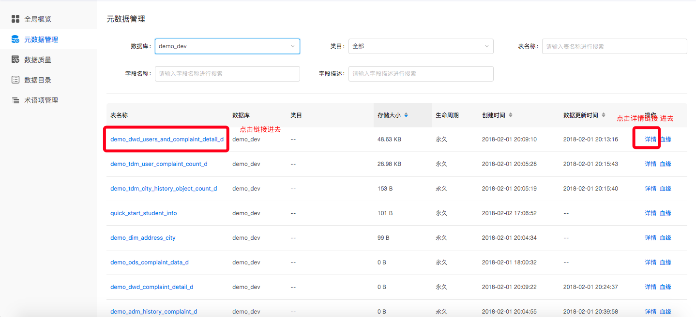

 	d.  进入到表详细信息页面，在基本信息中的所属类目，点击“修改”。

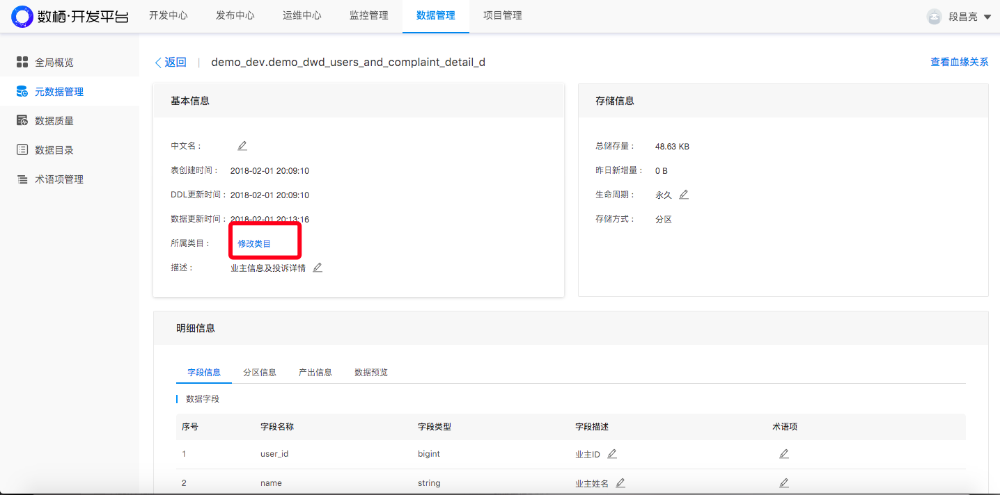

​	e.  所属类目选择刚才新建的数据类目，一直选择第3层级，点击“确定”，此时关联完成。

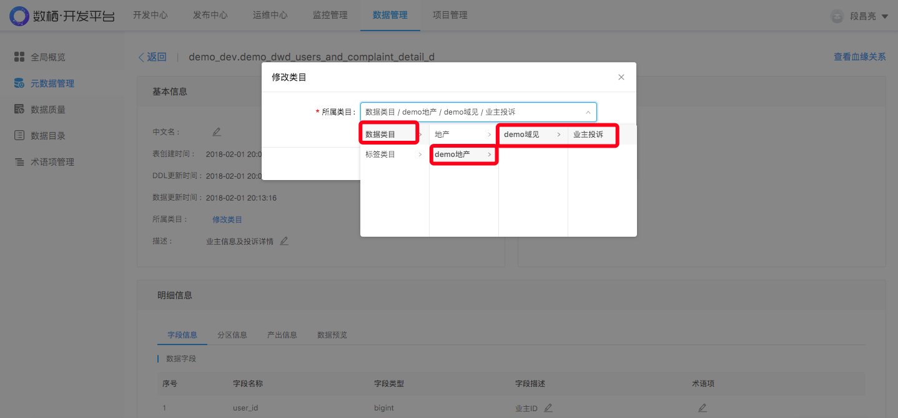

​	f.  回到数据类目管理，此时可以看到数据类目中已关联数据表。

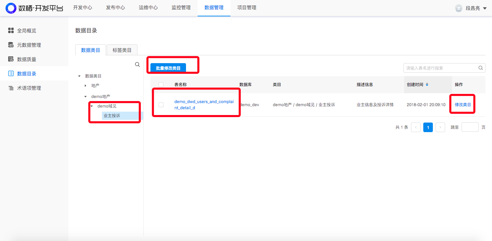

4）数据类目修改

​	a.  数据类目支持单个修改和批量修改。

​	b.  单个修改：选择某个数据类目，点击操作“修改类目”，选择相应更改为的数据类目，点击“确定”。

​	c.  批量修改：选择多个数据类目，或全选，点击类目列表上的“批量修改类目”，选择相应更改为的数据类目，点击“确定”。

5）数据类目删除

​	数据类目删除只需要从类目结构最后级开始删除，然后向上依次删除即可。

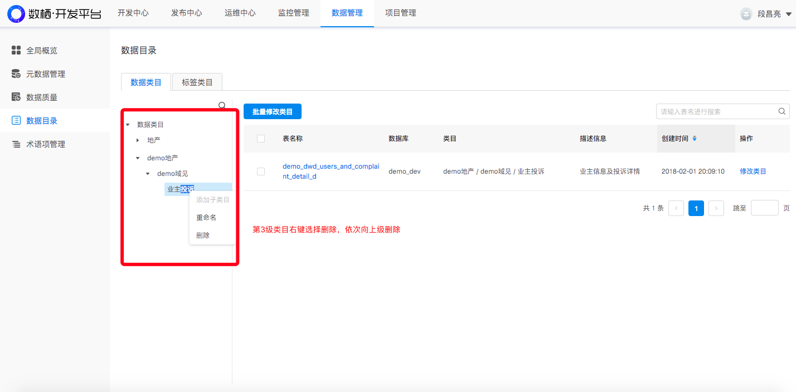

###### 4.5.4.2 标签类目

1）标签类目设置

​	用户（只有管理员有权限）可以自定义标签目录结构和类目体系，主要包含如下功能：

​		a.   类目导航和层级设置，可以根据实际的标签分类，自定义标签类目名称和层级结构。

​		b.   类目搜索，根据名称快速定位到需要寻找或修改的类目。

2）标签类目查看

​	根据设置的标签类目结构，显示标签类目结构图，并且支持根据类目名称快速定位到需要查找的类目。选择对应的三级类目之后可以展示该类目下的标签信息。

3）标签类目操作

​	标签类目新建和修改及删除都是与数据类目操作一样，只需要在选择时把数据类目变成标签类目即可。

##### 4.5.6 术语项管理

​	术语项管理是管理用户业务的术语；如社保类的窗口：医保、公积金等。用户（只有管理员有权限）可以自定义术语目录结构体系。

1）术语项类目设置

​	用户可以自定义术语项目录结构和类目体系，主要包含如下功能：

​		a.   类目导航和层级设置，可以根据实际的术语项分类，自定义术语类目名称和层级结构。

​		b.   类目搜索，根据名称快速定位到需要寻找或修改的类目。

2）术语项类目查看

​	根据设置的标签类目结构，显示标签类目结构图，并且支持根据类目名称快速定位到需要查找的类目。选择对应的三级类目之后可以展示该类目下的术语项信息。

3）术语项新建

​	a.  进入到术语项管理界面，右键“用户术语”点击“添加子术语”，依次添加3级术语结构。

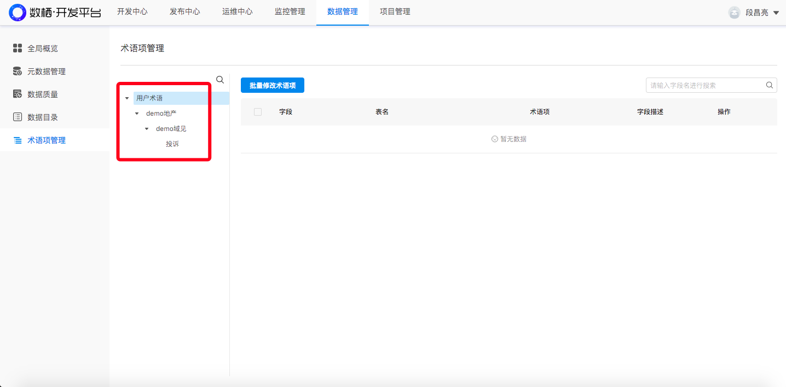

​	b.  术语项结构新建完成之后，进入到元数据管理界面，选择所要关联的数据表，点击“详情”。


​	c.  进入到明细信息的数据字段中，可看到术语项，点击“修改”。

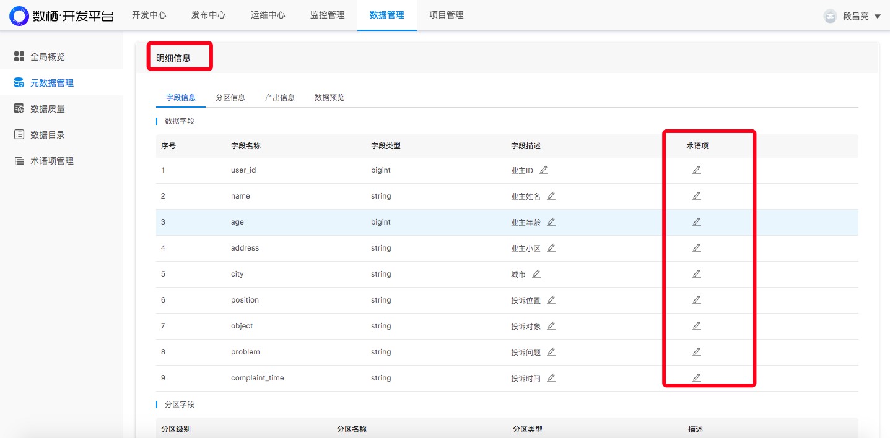

​	d.  选择相应的术语项。

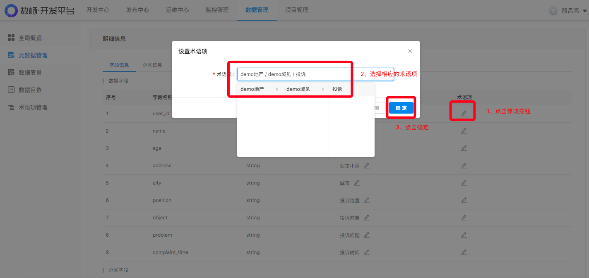

​	e.  回到术语英管理，可看到此时已关联了相应的表字段。

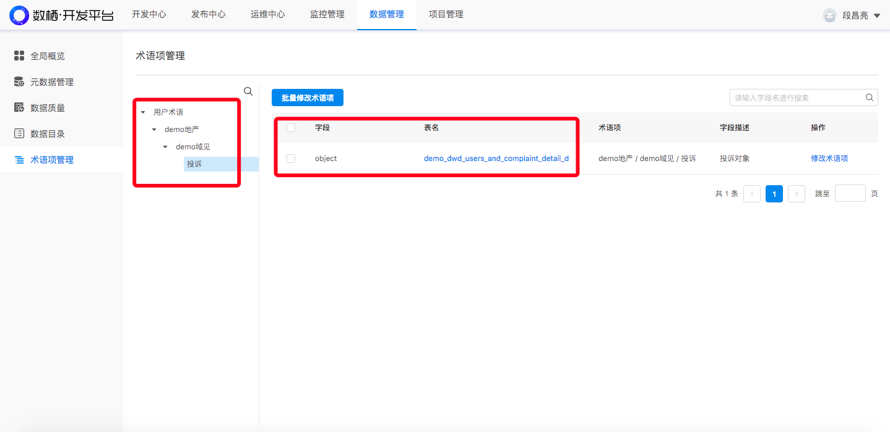

4）术语项删除和修改

​	术语项删除修改和数据类目的删除修改相同，请参照数据类目。

#### 4.6 项目管理
##### 4.6.1 项目配置

项目配置是对项目工作空间下基本信息、功能权限、任务类型等配置操作。功能权限包含：是否启用周期调度、是否允许直接编辑任务或代码、是否允许下载查询结果、下载结果限制、是否允许跨库访问等。 只有勾选了某任务类型，才可在开发中心新建该类型的任务。项目配置界面如4-6-1图所示：

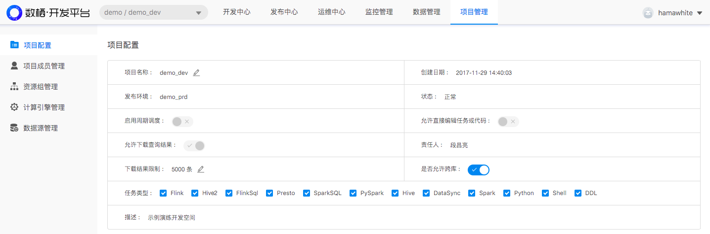<center>图 4-6-1 项目配置界面</center>

##### 4.6.2 项目成员管理

项目成员管理（只有平台管理员的权限才有此选项）此界面可查看已添加的成员，添加项目成员和移出项目成员；目前项目空间下有四个成员角色：开发、管理员、运维、访客，各成员角色请见[权限点划分](https://github.com/dtwave/shuxi/blob/master/doc/%E6%9D%83%E9%99%90%E7%82%B9%E5%88%92%E5%88%86.md)附件。项目成员管理界面如下所示：

<center>图 4-6-2项目成员管理界面</center>

点击“添加成员”，出现成员下拉列表（此处成员必须和申请的帐户为同一租户），可选多个成员，选择成员完成后，分配相应的角色，点击确定，出现系统提示“操作成功”即添加成功。

<center>图4-6-3 项目成员添加</center>

添加完成后，在项目成员管理可看到刚添加的人员。

<center>图4-6-4 项目成员添加完成</center>

项目成员删除，选择成员后面的“操作”-“移出本项目”即可。

##### 4.6.3 资源组管理

在资源组管理中可以新增资源组、更新资源组名称描述、管理资源组中的主机、查看主机信息(CPU  、内存信息、运行任务数)、对主机进行暂停/恢复。当主机被处于暂停状态时，该主机上不可再运行任务；当主机运行数达到最大任务数时也不可再运行任务。

资源组管理页如图4-6-5 所示：

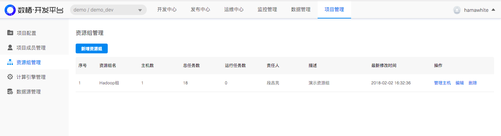<center>图4-6-5 资源组管理页面</center>

管理主机页如图4-6-6 所示：

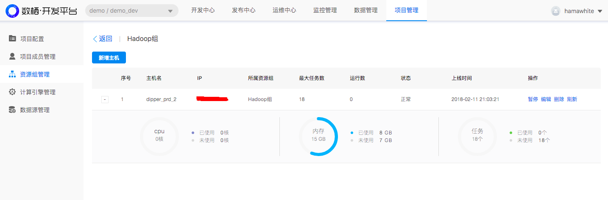 <center>图4-6-6 主机管理页面</center>

##### 4.6.4 计算引擎管理

计算引擎管理中包含离线引擎、即席引擎、实时调度信息，管理员或运维角色人员可以对引擎基本信息进行修改。实时调度信息中包含集群的CPU信息、内存信息和集群运行任务数信息。

计算引擎管理页如图4-6-7 所示：

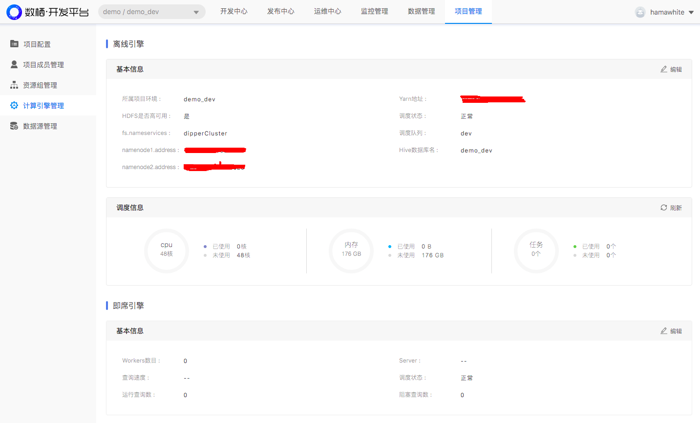<center>图4-6-7 计算引擎管理页面</center>

###### 4.6.4.1 离线引擎

离线引擎目前指hadoop集群，基本信息中包含yarn地址、HDFS地址、hive数据库名和调度队列。

###### 4.6.4.2 即席引擎

即席引擎指Presto 集群，基本信息中包含workers数目、server地址、调度状态、运行查询数和阻塞查询数。

##### 4.6.6 数据源管理

数据源管理是对项目空间下的数据源管理。数据源主要在开发中心DataSync类型的离线任务中使用，作为源头数据源或目的地数据源，在该页面可以对数据源进行新增、编辑和删除操作，数据源支持mysql、oracle、SQL Server、hive、ElasticSearch、Kafka、Greenplum、PostgreSQL、ODPS、MongoDB、HBase、OTS、ADS、HDFS等14种类型。

数据源管理页如图4-6-8 所示：

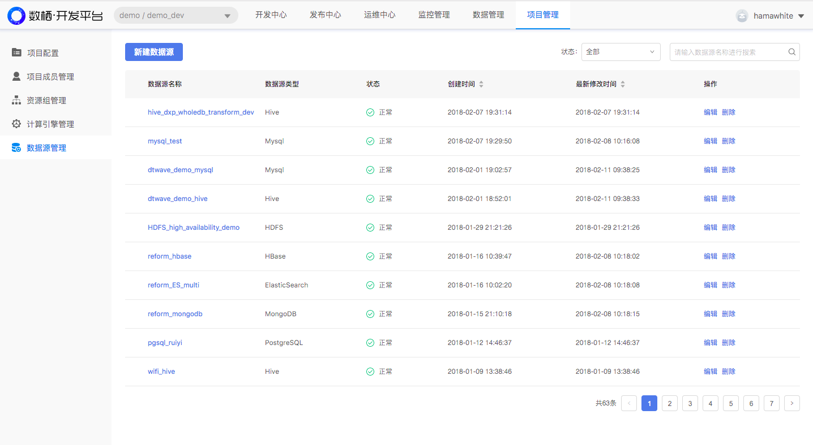<center>图4-6-8 数据源管理页面</center>

数据源新建如图4-6-9 所示：

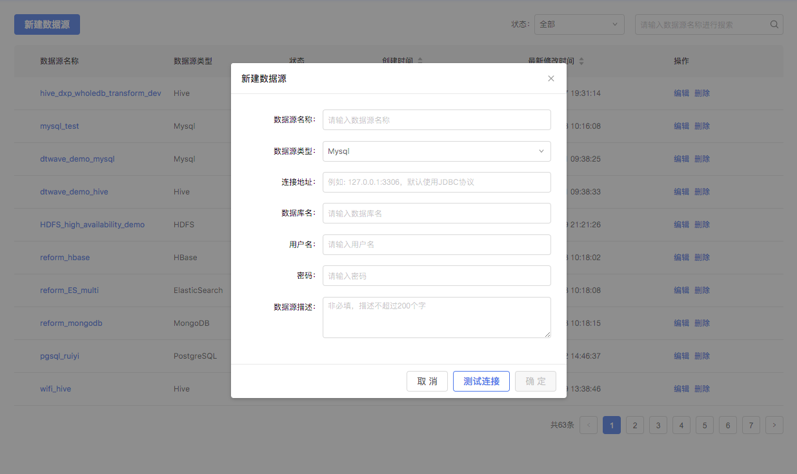<center>图4-6-9 数据源新建页面</center>

#### 4.7 高级功能
##### 4.7.1 新建项目空间

点击数栖平台右上角用户信息，右击选择添加项目，跳转到项目添加导航页，开始项目添加。导航页如图4-7-7所示：

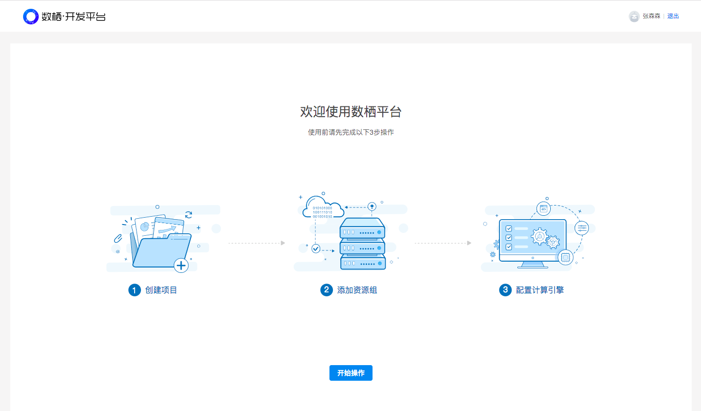<center>图4-7-7 项目空间添加导航页</center>

- 新建项目

  点击导航页“开始操作”，进入创建项目页面，填写项目名称、责任人、项目描述。创建项目页如图4-7-8 所示：

  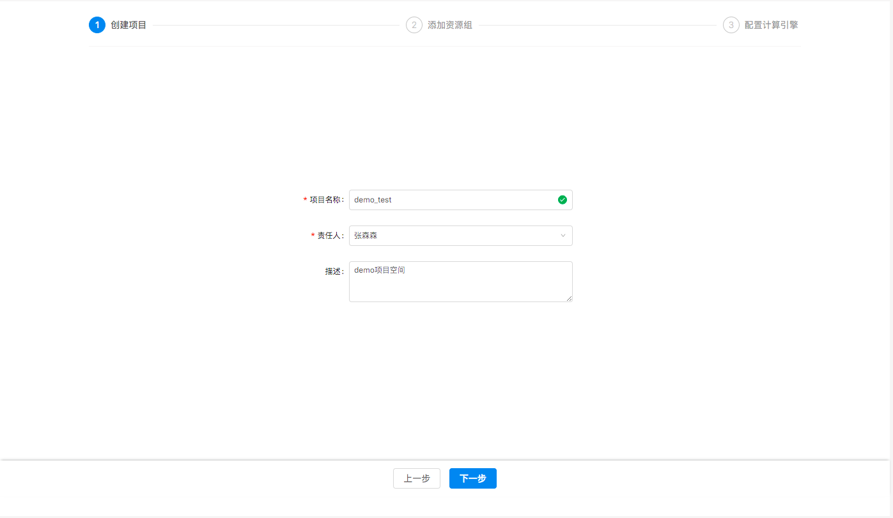<center>图4-7-8 创建项目页</center>

- 添加资源组

  进入添加资源组页，填写资源组名称、添加主机列表和资源组描述。添加主机时，需要填写主机名称、ip地址(安装dubheNode插件的服务器地址)、任务运行最大并发数。点击确定会校验主机联通性。添加资源组界面如图4-7-9 所示：

  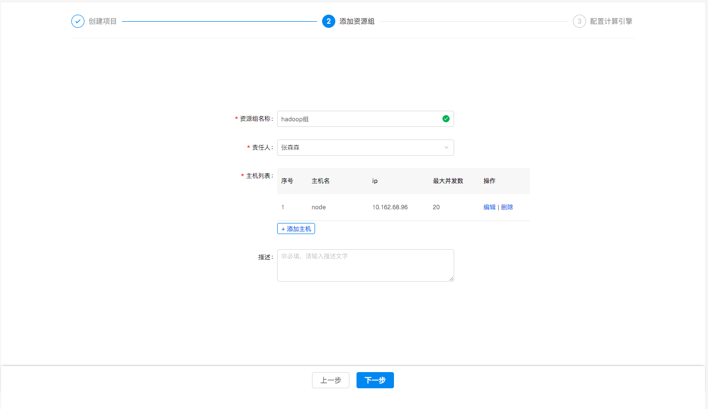<center>图4-7-9 创建项目页</center>

- 配置计算引擎

  添加完资源组后，进入最后一步配置计算引擎，填写hadoop的yarn地址、调度队列、hive数据库名称、HDFS地址(高可用模式、非高可用模式)、即席引擎地址，其中带有红色“*”的参数为必填项。即席引擎指Presto的地址。当生产环境的引擎和开发环境相同时，可以直接点击“使用开发环境配置”进行快速操作。配置引擎页如图4-7-10所示：

  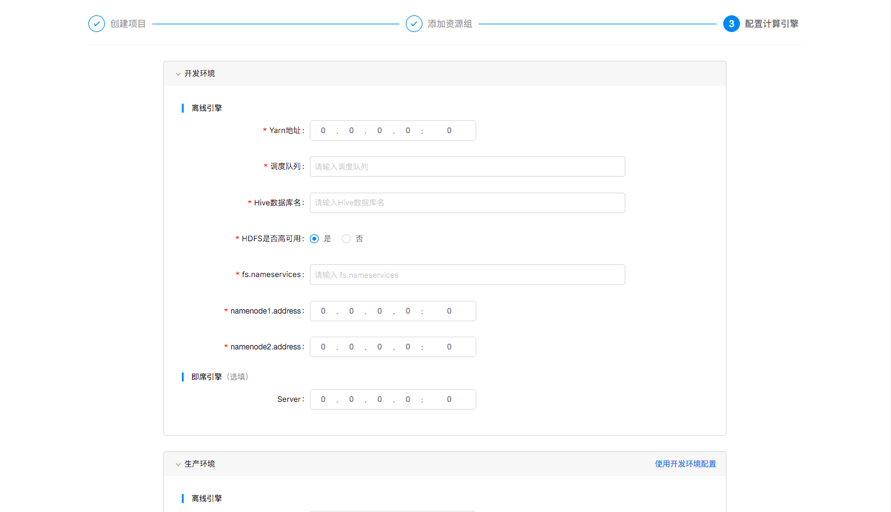<center>图4-7-10 配置计算引擎</center>


### 4. 案例实战
#### 4.1 背景介绍

本案例介绍如何使用数栖开发平台每天定时对业主信息和业主投诉内容等原始数据进行加工处理，以此实现对业主投诉信息数据的统计分析。

#### 4.2 数据开发流程介绍

数栖开发平台推荐使用数据仓库的概念进行数据开发。数据仓库分层标准为：ods、dwd、tdm、adm、dim。在各层目录下分ddl和job目录，这两个目录分别为各层下的建表语句目录和任务目录。

#### 4.3 开发
##### 4.3.1 DIM层

dim层存放维表数据，此层任务可以是定时任务，定时更新维表数据。本案例中dim层存放定时更新的业主所在小区和城市的映射关系数据，您需要先将维表数据上传到数栖开发平台，然后将数据导入表中。具体步骤如下:

1)  将把维表数据存储为txt格式的address_city.txt文件，且文件后缀名必须为txt。小区和城市的映射数据如下(字段之间以tab键分割):

```txt
金域湖庭  杭州
万科锦程  杭州
金色城市  杭州
万科红郡  上海
翡翠国际  深圳
```

2)  进入顶部菜单栏中的**开发中心**，导航至**资源开发**页面。

3)  点击**资源目录**，在弹框中选择**新建目录**，创建demo目录，在demo目录下创建dim目录。

4)  右键单击dim目录，选择**新建资源**，资源名address_city，资源类型txt，点击添加文件，选中要上传的address_city.txt文件，点击确定，完成上传。如图4-3-1所示：

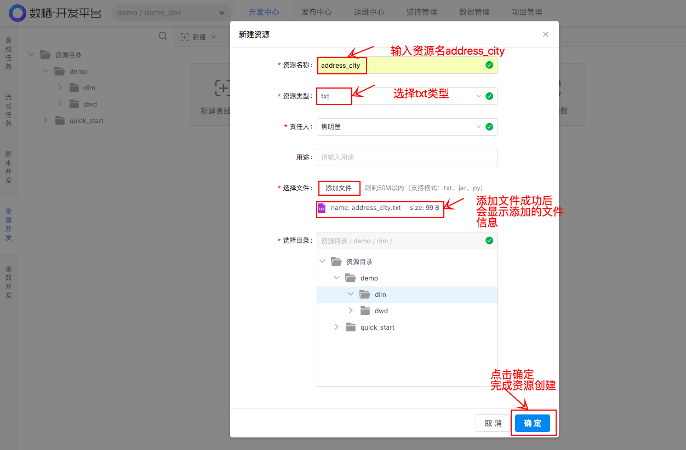<center>图 4-3-1 创建资源</center>

5)  在开发中心下，导航至**离线任务**页面。

6)  同样地，点击**离线任务目录**，在弹框中选择**新建目录**，创建demo目录，在demo目录下创建dim目录。

7)  在dim目录下新建ddl与job两个目录，DDL任务调度类型默认为暂停调度，当任务发布以后，DDL任务立即运行仅且运行一次。

8)  在demo/dim/ddl目录下创建DDL任务，任务名为`ddl_demo_dim_address_city`，在新建任务页面输入建表语句，点击**运行**，完成hive表创建工作，如图4-3-2所示：

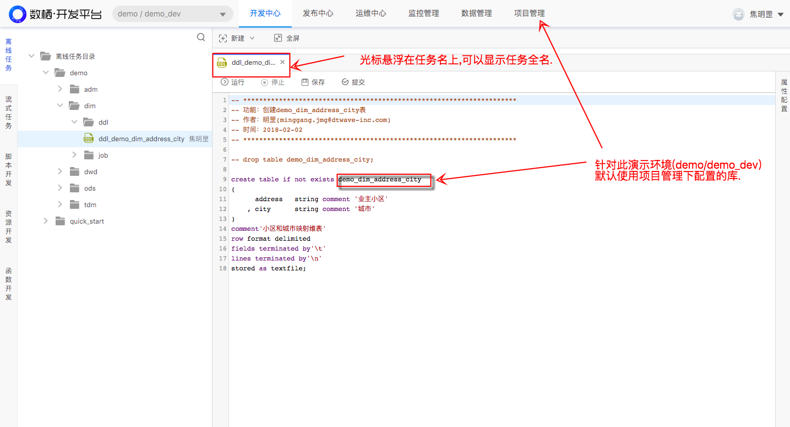<center>图 4-3-2 创建demo_dim_address_city表</center>

任务语句如下:


```sql
-- *********************************************************************
-- 功能：创建demo_dim_address_city表
-- 作者：明罡(minggang.jmg@dtwave-inc.com)
-- 时间：2018-02-02
-- *********************************************************************

-- drop table demo_dim_address_city;

create table if not exists demo_dim_address_city
(
    address string comment '业主小区'
  ， city    string comment '城市'
)
comment'小区和城市映射维表' 
row format delimited
fields terminated by'\t' 
lines terminated by'\n'
stored as textfile;
```

**注意**: 用户在数据开发中，不用指定数据库名。该任务在开发环境中执行的时候，表对应的库就是开发环境下的Hive库。发布到生产，在生产环境中执行的时候，表对应的库就是生产环境的Hive库。如果用户在表名前加了hive库名称，在开发和生产环境执行的时候，对应的表是用户指定的库中的表。开发环境和生产环境对应的库分别如图4-3-3、4-3-4 所示：

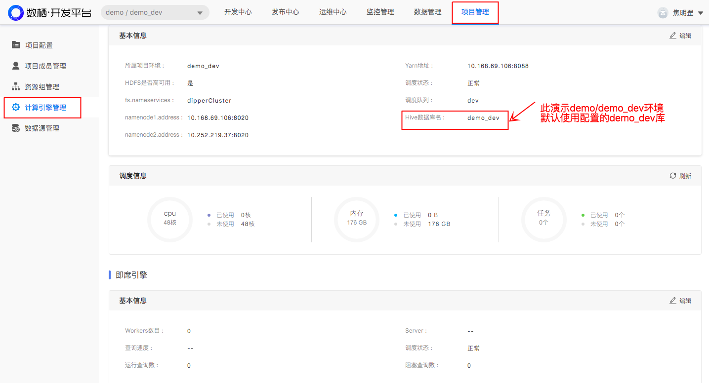<center>图 4-3-3 开发环境对应的hive库</center>

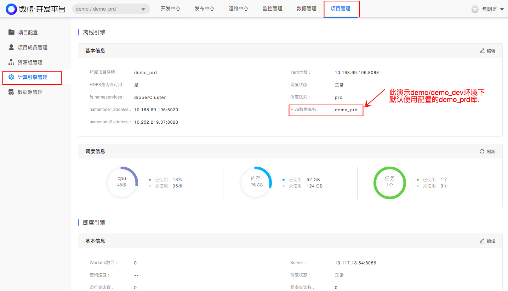<center>图 4-3-4 生产环境对应的hive库</center>

9)  在demo/dim/job目录下创建SparkSQL任务，任务名为`demo_dim_address_city`，在界面右侧**属性配置**中资源依赖里选择上传的资源address_city.txt，在新建任务页面输入任务语句，完成数据导入工作。如图4-3-5所示：

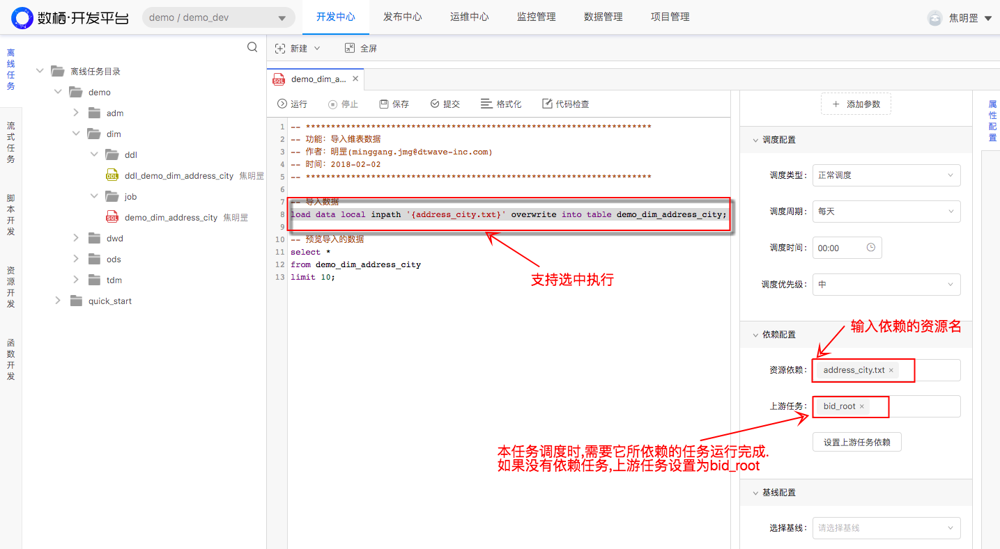<center>图 4-3-5 导入资源数据到demo_dim_address_city表</center>

任务语句如下：

```sql
-- *********************************************************************
-- 功能：导入维表数据
-- 作者：明罡(minggang.jmg@dtwave-inc.com)
-- 时间：2018-02-02
-- *********************************************************************

-- 导入数据
load data local inpath '{address_city.txt}' overwrite into table demo_dim_address_city;

-- 预览导入的数据
select *
from demo_dim_address_city
limit 10;
```
10) 运行部分日志如图4-3-6所示，如果在运行中如果返回日志太多，可以点击回收站图标来删除日志。

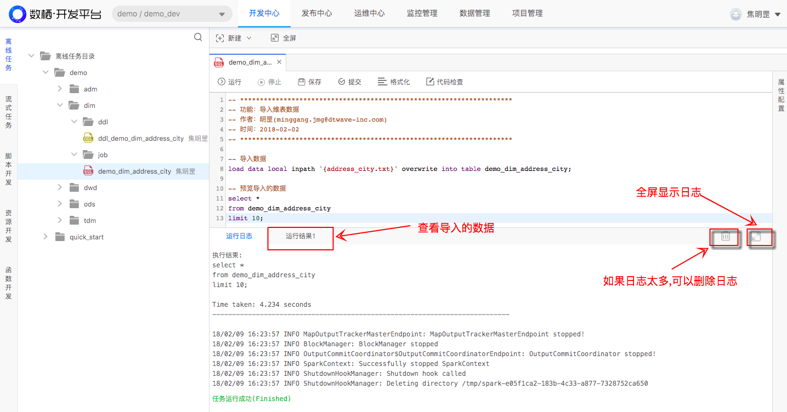 <center>图 4-3-6 demo_dim_address_city任务运行部分日志</center>

##### 4.3.2 ODS层

ods层存储原始数据，此层数据保持原貌，不做任何改动。本案例中ods层的数据来源于mysql中的业主投诉数据和业主信息，您需要将mysql中的数据同步到数栖平台hive库中。具体步骤如下:

1)  在mysql中创建demo_complaint_data表，并向其导入投诉数据，语句如下:

```sql
#创建demo_complaint_data表
create table demo_complaint_data (
    user_id     int
  ， context     text
  ， complaint_time  text
) ENGINE=InnoDB DEFAULT CHARSET=utf8;

#向demo_complaint_data插入数据
insert into demo_complaint_data (user_id, context, complaint_time)
VALUES
(5, '你好，我家厨房的地漏堵着了'， '2017-07-01')，
(5, '客服人员，卧室门吸吸不住，很影响使用'， '2017-03-23')，
(4, '厨房窗户关不上'， '2017-06-12')，
(4, '卫生间水管渗水，房子都不能住了'， '2017-07-09')，
(3, '我要投诉，我家的进户门门框开裂严重，很长时间了还不来维修'， '2017-08-01')，
(3, '投诉好久了，我家的主卧地板发黑，现在都没人管！'， '2017-05-12')，
(2, '客服你好，厨房台面有点开裂'， '2017-07-25')，
(2, '卫生间马桶下水慢，请快速解决'， '2017-07-03')，
(1, '我家洗手间的门槛石缺损了，请尽快维修'， '2017-07-23')，
(1, '浴室门上都是划痕'， '2017-07-04')，
(1, '卫生间门把手松动，门都发不开，快点来维修'， '2017-06-23')，
(1, '你好，卧室门有污渍，清理不掉'， '2017-04-15');
```

2)  在mysql中创建demo_users表，并向其导入业主信息，语句如下:

```sql
#创建demo_users表
create table demo_users (
  user_id int,
  name text,
  age int,
  address text
) ENGINE=InnoDB DEFAULT CHARSET=utf8;

#向demo_users插入数据
insert into demo_users (user_id, name, age, address)
VALUES
  (1, '张林静'， 23, '金域湖庭')，
  (2, '王勇'， 54, '万科锦程')，
  (3, '李志刚'， 56, '金色城市')，
  (4, '赵晓丽'， 23, '万科红郡')，
  (5, '杜孟娟'， 67, '翡翠国际');
```

3)  使用数栖平台的DataSync任务将mysql中demo_complaint_data与demo_users表中的数据同步到数栖平台的hive库中。首先需要创建数据来源(数据从哪里来)，数据目的源(数据到哪里去)。

进入顶部菜单栏中的**项目管理**，导航至**数据源管理**页面，点击**新建数据源**。创建数据的来源`dtwave_demo_mysql`，以及数据的目的源`dtwave_demo_hive`两个数据源。分别如图4-3-7、4-3-8所示:

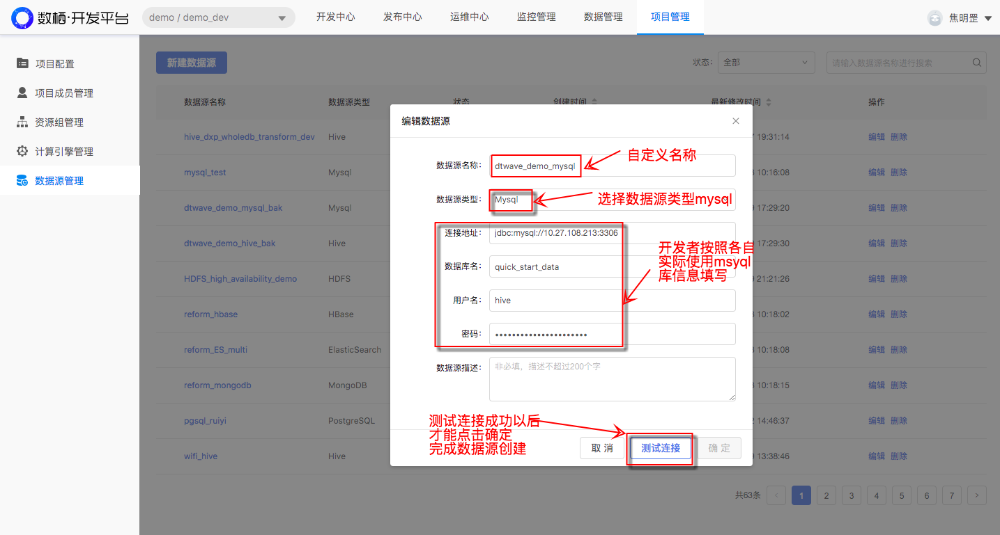<center>图 4-3-7 创建dtwave_demo_mysql数据源</center>

<center>图 4-3-8 创建dtwave_demo_hive数据源</center>

4)  数据源创建完成以后，进行DataSync同步任务的开发。进入顶部菜单栏中的**开发中心**，导航至**离线任务**页面，在demo目录下创建ods目录，ods目录下新建ddl与job目录。

5)  在demo/ods/ddl目录下新建离线DDL任务，任务名称:`ddl_demo_ods_complaint_data_d`在新建任务页面输入建表语句，点击**运行**，完成hive表创建工作。任务语句如下：


```sql
-- *********************************************************************
-- 功能：创建demo_ods_complaint_data_d表
-- 作者：明罡(minggang.jmg@dtwave-inc.com)
-- 时间：2018-02-02
-- *********************************************************************

-- drop table if exists demo_ods_complaint_data_d;

create table if not exists demo_ods_complaint_data_d
(
    user_id     bigint comment '业主ID'
  ， content     string comment '投诉内容'
  ， complaint_time  string comment '投诉时间'
)
comment '业主投诉内容表'
partitioned by (ds string comment '按天分区，例如20160620')
stored as parquet;
```

同样地，在demo/ods/ddl目录下创建`ddl_demo_ods_users_info`任务，任务类型为DDL。按照上述操作创建demo_ods_users_info表。任务语句如下：


```sql
-- *********************************************************************
-- 功能：创建demo_ods_users_info表
-- 作者：明罡(minggang.jmg@dtwave-inc.com)
-- 时间：2018-02-02
-- *********************************************************************

-- drop table if exists demo_ods_users_info;

create table if not exists demo_ods_users_info
(
    user_id bigint comment '业主ID'
  ， name    string comment '业主名字' 
  ， age   bigint comment '业主年龄' 
  ， address string comment '业主小区'
)
comment '业主信息表'
stored as parquet;
```

6)  将mysql库中的demo_complaint_data表中的数据同步到hive库demo_ods_complaint_data_d中。在demo/ods/job目录下新建离线DataSync任务，任务名称:`demo_ods_complaint_data_d`。如图4-3-9、4-3-10、4-3-11、4-3-12所示。

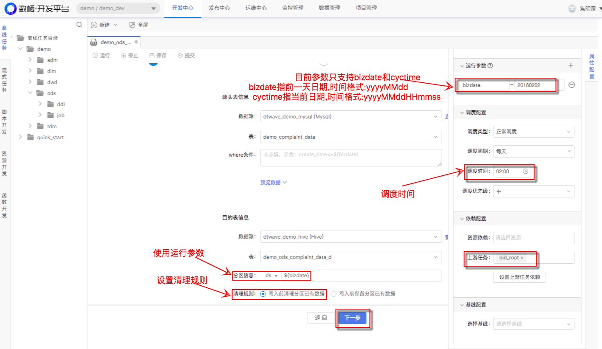<center>图 4-3-9 创建demo_ods_complaint_data_d任务 步骤A</center>

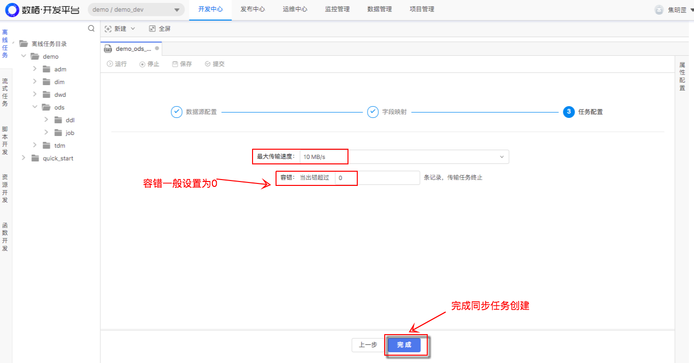<center>图 4-3-10 创建demo_ods_complaint_data_d任务 步骤B</center>

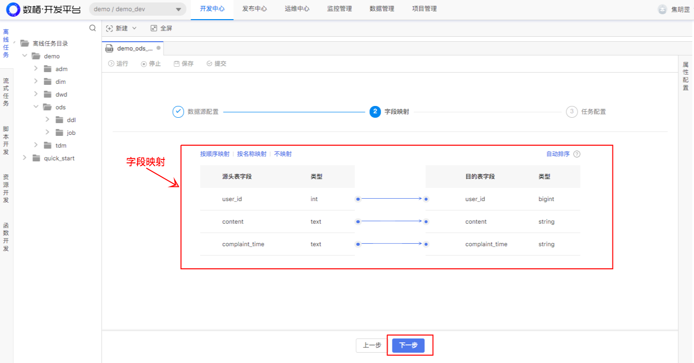<center>图 4-3-11 创建demo_ods_complaint_data_d任务 步骤C</center>

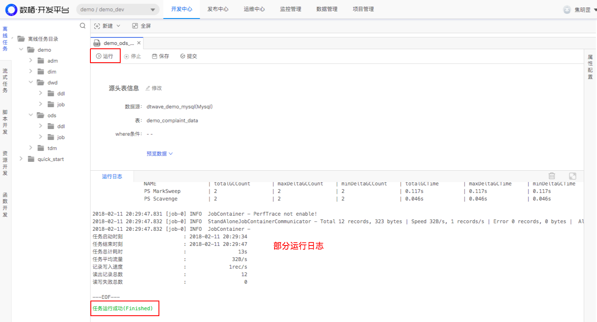<center>图 4-3-12 创建demo_ods_complaint_data_d任务 步骤D</center>

任务内容如下: 

```txt
A.数据源配置
  源头表信息下的数据源为dtwave_demo_mysql,然后选择此数据源下的demo_complaint_data表。
  目的表信息下的数据源为dtwave_demo_hive,然后选择此数据源下的demo_ods_complaint_data_d表，分区信息ds=${bizDate}(bizDate为我们定义的时间分区，在此界面的右侧有属性配置，在运行参数下点击'添加参数'来定义我们的bizDate,在本演示中我们定义为bizDate - 20180202)，选择'写入前清理分区以有数据'，点击'下一步'
B.字段映射
  可以查看源表与目的表之间字段的映射关系，这里不做任何操作，点击下一步。
C.任务配置
  填上当出错超过0条记录，传输任务终止！
D.运行同步任务
  点击此任务页面上的运行任务，开始同步我们的数据。可以在下方看到任务运行日志。
```

同样地，将mysql库中的demo_users表中的数据同步到hive库demo_ods_users_info中。在demo/ods/job目录下新建离线DataSync任务，任务名称:`demo_ods_users_info`。任务内容如下：

```txt
A.数据源配置
  源头表信息下的数据源为在步骤3创建的'dtwave_demo_mysql'，然后选择此数据源下的demo_users表。
  目的表信息下的数据源为在步骤3创建的'dtwave_demo_hive'，然后选择此数据源下的demo_ods_users_info表，因为'demo_ods_users_info'不是分区表，所以没有分区信息，直接点击'下一步'。
B.字段映射
  可以查看源表与目的表之间字段的映射关系，这里不做任何操作，点击下一步。
C.任务配置
  填上当出错超过0条记录，传输任务终止！ 
D.运行同步任务
  点击此任务页面上的运行任务，开始同步我们的数据。可以在下方看到任务运行日志。
```

##### 4.3.3 DWD层

ods层数据经过清洗，初加工以后存放在dwd层。本案例需要使用算法模型从业主投诉信息中获取投诉区域、投诉对象、投诉问题，然后合并dim层的数据，获得以业主对象的所有信息，具体步骤如下：

1) 采用算法模型，编写udf函数，从投诉信息中获取投诉区域、投诉对象、投诉问题。

2) udf相关代码在[Github](https://github.com/dtwave/shuxi)上，clone下来在本地编译。

3) 将编译好的udf的jar包上传到**开发中心**的**资源开发**页面下的demo/dwd/udf目录下面，目录如果不存在则需创建。

4) 点击udf目录，选择**新建资源**。资源名：extract_complaint，资源类型：jar，然后在**选择文件**中添加编译好的jar包。如图4-3-13所示：

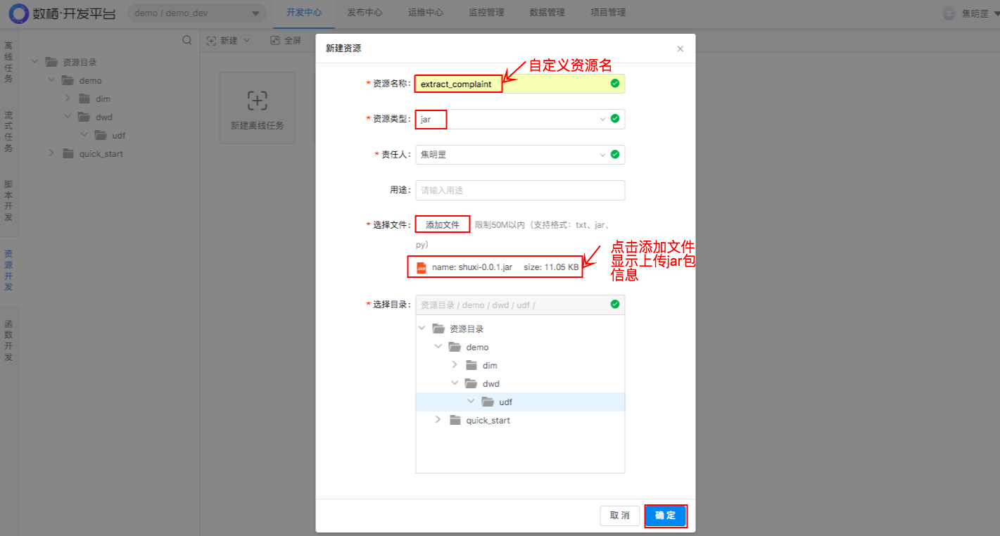<center>图 4-3-13 上传jar包</center>

5) 在**开发中心**的**函数开发**页面下，点击函数目录，创建demo/udf目录。点击udf目录选择新建函数来创建我们的udf函数，函数名称：extract_complaint，类名：com.dtwave.hive. ExtractComplaintUDF(类名全路径)，资源依赖：extract_complaint.jar。用途、命令格式、参数说明这三个参数选填。如图4-3-14所示：

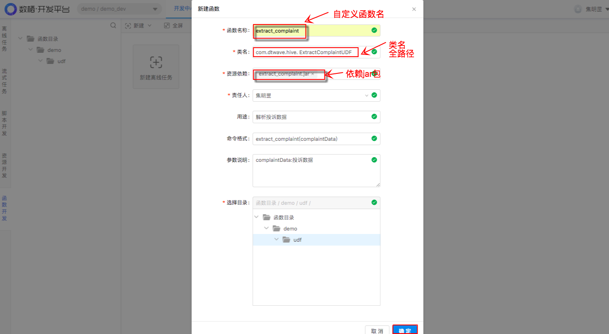<center>图 4-3-14 创建udf函数</center>

6）在**开发中心**的**离线任务**的demo目录下新建dwd目录，同样在dwd目录下新建ddl与job两个目录。

7）在demo/dwd/ddl目录下创建任务。点击ddl目录，选中**新建离线DDL任务**，任务名为`ddl_demo_dwd_complaint_detail_d`，在新建任务页面输入建表语句，点击**运行**，完成hive表创建工作。任务语句如下:


```sql
-- *********************************************************************
-- 功能：创建demo_dwd_complaint_detail_d表
-- 作者：明罡(minggang.jmg@dtwave-inc.com)
-- 时间：2018-02-02
-- *********************************************************************

-- drop table demo_dwd_complaint_detail_d;

create table if not exists demo_dwd_complaint_detail_d
( 
    user_id     bigint comment '业主ID'
  , position      string comment '投诉位置'
  , object      string comment '投诉对象'
  , problem     string comment '投诉问题'
  , complaint_time  string comment '投诉时间'
)
comment '投诉详情信息'
partitioned by (ds string comment '按天分区,例如20160620')
stored as parquet;
```

同样地，在demo/dwd/ddl目录下创建`ddl_demo_dwd_users_and_complaint_detail_d`任务，任务类型为DDL，按照上述操作创建demo_dwd_users_and_complaint_detail_d表。任务语句如下:


```sql
-- *********************************************************************
-- 功能：创建demo_dwd_users_and_complaint_detail_d表
-- 作者：明罡(minggang.jmg@dtwave-inc.com)
-- 时间：2018-02-02
-- *********************************************************************

-- drop table demo_dwd_users_and_complaint_detail_d;

create table if not exists demo_dwd_users_and_complaint_detail_d
(
      user_id     bigint comment '业主ID'
  , name        string comment '业主姓名'
  , age       bigint comment '业主年龄'
  , address     string comment '业主小区'
  , city        string comment '城市'
  , position      string comment '投诉位置'
  , object      string comment '投诉对象'
  , problem     string comment '投诉问题'
  , complaint_time  string comment '投诉时间'
)
comment '业主信息及投诉详情'
partitioned by (ds string comment '按天分区,例如20160620')
stored as parquet;
```

8）在demo/dwd/job目录下创建任务。点击job目录，选中**新建离线SparkSQL任务**，任务名为`demo_dwd_complaint_detail_d`，在此任务中使用创建的udf函数解析投诉信息，获取投诉位置、投诉对象、投诉问题。任务语句如下：

```sql
-- *********************************************************************
-- 功能：采用算法模型解析投诉信息,获取投诉位置,投诉对象,投诉问题！
-- 函数：extract_complaint('我家里卫生间的马桶漏水了') 返回 {"problem":"漏水","position":"卫生间","object":"马桶"}
-- 函数：get_json_object(extract_complaint('我家里卫生间的马桶漏水了'),'$.position') 返回 卫生间
-- 作者：明罡(minggang.jmg@dtwave-inc.com)
-- 时间：2018-02-02
-- ********************************************************************

insert overwrite table demo_dwd_complaint_detail_d partition(ds = '${bizDate}')
select   user_id
       , get_json_object(extract_complaint(content), '$.position') as position
       , get_json_object(extract_complaint(content), '$.object') as object
       , get_json_object(extract_complaint(content), '$.problem') as problem
       , complaint_time
from demo_ods_complaint_data_d
where ds = '${bizDate}';  
```

同样地，在demo/dwd/job目录下创建`demo_dwd_users_and_complaint_detail_d`任务，任务类型为SparkSQL，在此任务中通过多表join获得以业主为对象的所有信息。任务语句如下：

```sql
-- *********************************************************************
-- 功能：通过多表join获得以业主为对象的所有信息
-- 作者：明罡(minggang.jmg@dtwave-inc.com)
-- 时间：2018-02-02
-- ********************************************************************

insert overwrite table demo_dwd_users_and_complaint_detail_d partition(ds = '${bizDate}')
select  b.user_id
      , b.name
      , b.age
      , b.address
      , c.city
      , a.position
      , a.object
      , a.problem
      , a.complaint_time
from demo_dwd_complaint_detail_d as a
left join 
  demo_ods_users_info as b
on b.user_id = a.user_id and a.ds = '${bizDate}'
left join 
  demo_dim_address_city as c 
on c.address = b.address;
```
##### 4.3.4 TDM层

tdm层为数据标签层，通常在此层，标签化dwd层数据。本案例需要获得标签：每个城市历史以来的各投诉对象总次数、各个业主历史以来的投诉总次数、各个业主详细信息及历史以来的投诉位置总次数。具体步骤如下：

1）在**开发中心**的**离线任务**的demo目录下新建tdm目录，同样在tdm目录下新建ddl与job两个目录。

2）创建标签（每个城市历史以来的各投诉对象总次数）表，在demo/tdm/ddl目录下**新建离线DDL任务**，任务名为`ddl_demo_tdm_city_history_object_count_d`，在新建任务页面输入建表语句。任务语句如下：


```sql
-- *********************************************************************
-- 功能：创建demo_tdm_city_history_object_count_d表
-- 作者：明罡(minggang.jmg@dtwave-inc.com)
-- 时间：2018-02-02
-- *********************************************************************

-- drop table demo_tdm_city_history_object_count_d;

create table if not exists demo_tdm_city_history_object_count_d
(
      city    string comment '城市'
  , object  string comment '投诉对象'
  , number  bigint comment '投诉次数'
)
comment '历史以来各个城市投诉对象次数统计'
partitioned by (ds string comment '按天分区,例如20160620')
stored as parquet;
```

同样地创建标签各个业主历史以来的投诉总次数表，在demo/tdm/ddl目录下创建`ddl_demo_tdm_user_complaint_count_d`任务，任务类型为DDL。任务语句如下：


```sql
-- *********************************************************************
-- 功能：创建demo_tdm_user_complaint_count_d表
-- 作者：明罡(minggang.jmg@dtwave-inc.com)
-- 时间：2018-02-02
-- *********************************************************************

-- drop table demo_tdm_user_complaint_count_d;

create table if not exists demo_tdm_user_complaint_count_d
(
    user_id     bigint comment '业主ID'
  , complaint_number  bigint comment '投诉次数'
)
comment '业主投诉总次数'
partitioned by (ds string comment '按天分区,例如20160620')
stored as parquet;
```

创建各个业主详细信息及历史以来的投诉位置总次数表，在demo/tdm/ddl目录下创建`ddl_demo_tdm_user_complaint_position_count_d`任务，任务类型为DDL。任务语句如下：


```sql
-- *********************************************************************
-- 功能：创建demo_tdm_user_complaint_position_count_d表
-- 作者：明罡(minggang.jmg@dtwave-inc.com)
-- 时间：2018-02-02
-- *********************************************************************

-- drop table demo_tdm_user_complaint_position_count_d;

create table if not exists demo_tdm_user_complaint_position_count_d
(
    user_id     bigint comment '业主ID'
  , name        string comment '业主姓名'
  , age       bigint comment '业主年龄'
  , address     string comment '业主小区'
  , city        string comment '城市'
  , position      string comment '投诉位置'
  , position_number bigint comment '投诉次数'
)
comment '业主投诉位置次数统计'
partitioned by (ds string comment '按天分区,例如20160620')
stored as parquet;
```

3）统计每个城市历史以来的各投诉对象总次数，在demo/tdm/job目录下创建SparkSQL任务，任务名为`demo_tdm_city_history_object_count_d`。如图4-3-15所示：

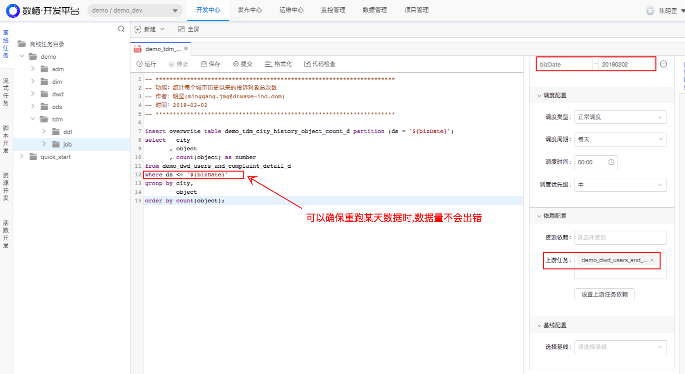<center>图 4-3-15 创建demo_tdm_city_history_object_count_d任务</center>

任务语句如下：

```sql
-- *********************************************************************
-- 功能：统计每个城市历史以来的投诉对象总次数
-- 作者：明罡(minggang.jmg@dtwave-inc.com)
-- 时间：2018-02-01
-- *********************************************************************

insert overwrite table demo_tdm_city_history_object_count_d partition (ds = '${bizDate}')
select   city
       , object
       , count(object) as number
from demo_dwd_users_and_complaint_detail_d
where ds <= '${bizDate}'
group by city,
         object
order by count(object);
```

4）统计各个业主历史以来的投诉总次数，在demo/tdm/job目录下创建SparkSQL任务，任务名为`demo_tdm_user_complaint_count_d`，任务语句如下：

```sql
-- *********************************************************************
-- 功能：统计各个业主历史以来的投诉总次数
-- 作者：明罡(minggang.jmg@dtwave-inc.com)
-- 时间：2018-02-01
-- *********************************************************************

insert overwrite table demo_tdm_user_complaint_count_d partition(ds = '${bizDate}')
select   user_id
       , count(user_id) as number
from demo_dwd_complaint_detail_d
where ds <= '${bizDate}'
group by user_id;

```

5）获取各个业主详细信息及历史以来的投诉位置总次数，在demo/tdm/job目录下创建SparkSQL任务任务名为demo_tdm_user_complaint_position_count_d，任务语句如下：

```sql
-- *********************************************************************
-- 功能：获取各个业主详细信息及历史以来的投诉位置总次数
-- 作者：明罡(minggang.jmg@dtwave-inc.com)
-- 时间：2018-02-01
-- *********************************************************************

insert overwrite table demo_tdm_user_complaint_position_count_d partition (ds = '${bizDate}')
select distinct a.user_id
                , a.name
                , a.age
                , a.address
                , a.city
                , a.position
                , count(position) over(partition by user_id,position) as number
from demo_dwd_users_and_complaint_detail_d a
where ds <= '${bizDate}';
```

##### 4.3.5 ADM层

adm层为数据应用层，按照特定的业务组织标签数据。本案例演示如何在此层统计各个业主详细信息、各个业主历史以来的各投诉位置总次数及投诉总次数，具体步骤如下：

1）在**开发中心**的**离线任务**的demo目录下新建adm目录，在tdm目录下新建ddl与job两个目录。

2）创建标签（各个业主详细信息、各个业主历史以来的各投诉位置总次数及投诉总次数）表，在demo/adm/ddl目录下创建DDL任务，任务名为`ddl_demo_adm_history_complaint_d`，在新建任务页面输入建表语句。任务语句如下:


```sql
-- *********************************************************************
-- 功能：创建demo_adm_history_complaint_d表
-- 作者：明罡(minggang.jmg@dtwave-inc.com)
-- 时间：2018-02-02
-- *********************************************************************

-- drop table demo_adm_history_complaint_d;

create table if not exists demo_adm_history_complaint_d
(
      user_id     bigint comment '业主ID'
  , name        string comment '业主姓名'
  , age       bigint comment '业主年龄'
  , address     string comment '业主地址'
  , city        string comment '城市'
  , position      string comment '投诉位置'
  , position_number bigint comment '投诉位置次数'
  , complaint_number  bigint comment '总投诉次数'
)
comment '业主投诉位置以及投诉总次数'
partitioned by (ds string comment '按天分区,例如20160620')
stored as parquet;
```

3）统计各个业主详细信息、各个业主历史以来的各投诉位置总次数及投诉总次数，在demo/adm/job目录下创建SparkSQL任务，任务名为`demo_adm_history_complaint_d`，任务语句如下：

```sql
-- *********************************************************************
-- 功能：统计各个业主详细信息、各个业主历史以来的各投诉位置总次数及投诉总次数
-- 作者：明罡(minggang.jmg@dtwave-inc.com)
-- 时间：2018-02-02
-- ********************************************************************

insert overwrite table demo_adm_history_complaint_d partition (ds = '${bizDate}')
select   a.user_id
       , a.name
       , a.age
       , a.address
       , a.city
       , a.position
       , a.position_number
       , b.complaint_number
from demo_tdm_user_complaint_position_count_d as a
join demo_tdm_user_complaint_count_d as b 
on a.user_id = b.user_id;

-- 预览数据
select *
from demo_adm_history_complaint_d
where ds = '${bizDate}'
limit 10;
```
##### 4.3.6 配置

基线作用：如果到某个时间点以后，任务还没完成或者还在进行，对开发人员来说，这可能是一个异常情况。我们可以给任务配置基线，对于没有按时完成的任务进行告警，告警方式有邮件：短信，钉钉，语音。配置基线具体步骤如下：

1) 创建基线

在**监控管理**页面下，导航至**基线管理**，点击**新增基线**,在新增基线弹窗中进行基线配置。如图4-3-16、4-3-17 所示：

 <center>图 4-3-16 新增基线</center>

 <center>图 4-3-17 新增基线 </center>

2) 配置基线 

一般只需要对于项目中关键任务配置基线，本案例中对tdm层的demo_tdm_city_history_object_count_d、demo_tdm_city_history_object_count_d、demo_tdm_user_complaint_position_count_d 三个任务配置基线。如图4-3-18 所示：

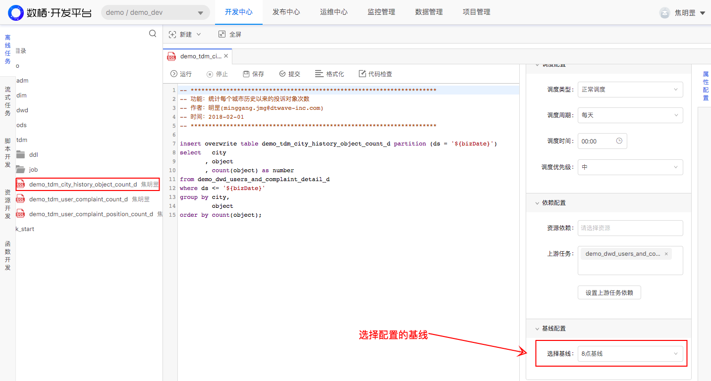<center>图 4-3-18 基线配置</center>

#### 4.4 发布

在开发环境下完成的任务、上传的资源、新建的udf函数，经过测试以后，可以发布到生产环境依据设置的调度时间进行周期调度运行，步骤如下：

**注意**：DDL任务也需要发布，当DDL任务发布以后，DDL任务立即运行且仅运行一次。

1）因为我们使用的是开发环境下的数据源，需要新建生产环境的数据源，如图4-4-1所示。

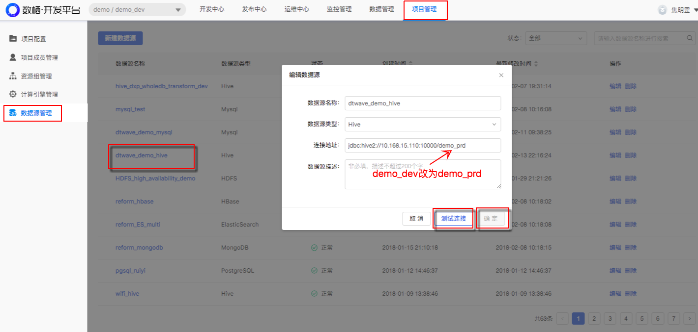<center>图 4-4-1 发布任务</center>

2）任务配置调度时间、基线、资源依赖、上游任务等参数以后（DDL任务只需配置上游任务），点击各个任务页面上的**提交**，填写好提交信息(非必需)，进行提交任务。

**注意**：对于没有任务依赖的任务，上游任务默认为bid_root。系统会默认提交资源、udf函数到发布包列表页面。

3）在**发布中心**的**创建发布包**页面下选中我们提交的任务、资源、函数，这时在右侧的**待发布对象**中会看到我们选中的任务、资源、函数，然后点击创建发布包，填写发布包名称、发布描述，点击确定完成创建发布包。如图4-4-2、4-4-3所示：

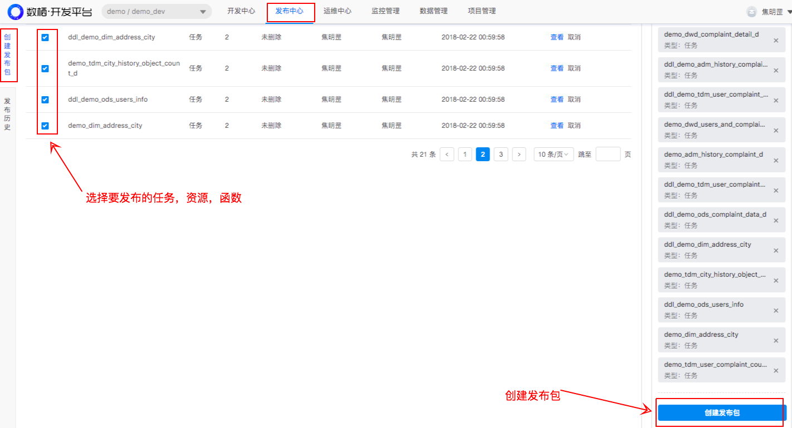 <center>图 4-4-2 创建发布包 </center>

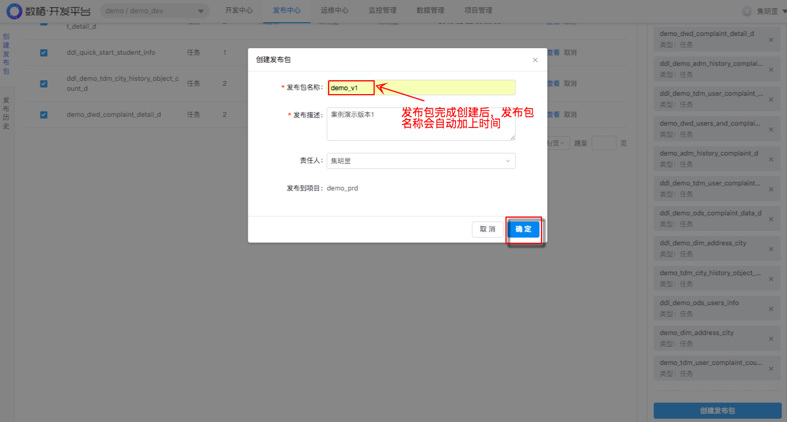<center>图 4-4-3 创建发布包 </center>

4）点击**发布中心**下的**发布历史**，可以看到我们刚才创建的发布包。这时通知有发布权限的管理员发布我们的发布包。如图4-4-4所示：

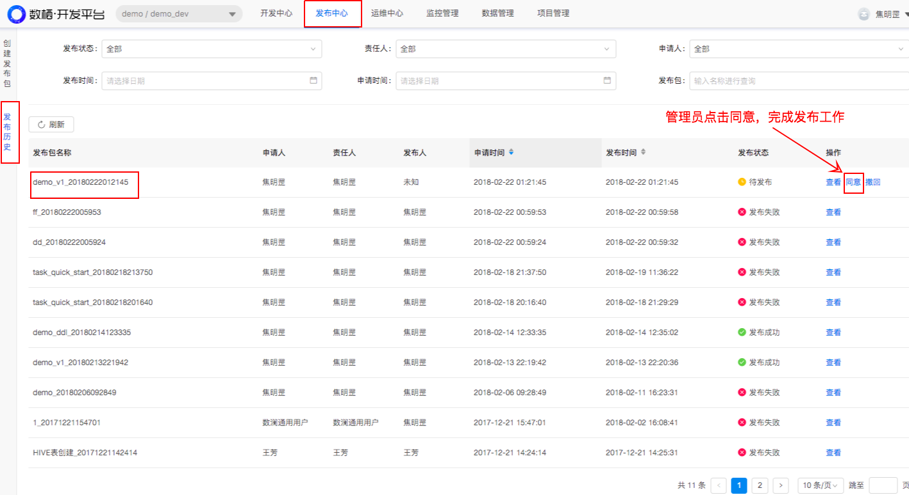 <center>图 4-4-4 发布任务</center>

#### 4.5 运维

在生产环境的运维中心下可以通过运行总览页可以查看离线任务、流式任务的统计信息，包含运行总任务数、当前时间任务运行数、已完成的任务数、待运行任务数、失败任务数等信息。还可以在离线实例页面查看实例上下游依赖、实例运行状态、实例基本信息等，进行展开父节点、展开子节点、查看运行日志、查看代码、终止、重跑、重跑下游、置成功等操作。具体操作介绍详见本文 **4.3 运维 **章节。
#### 4.6 数据管理
##### 4.6.1 配置数据质量

在数据质量中对demo_prd库中demo_adm_history_complaint_d表进行每日新增存储量进行监控配置，配置如下图4-6-1 所示，其他数据质量规则配置详见本文 **4.5.3 数据质量 **章节。

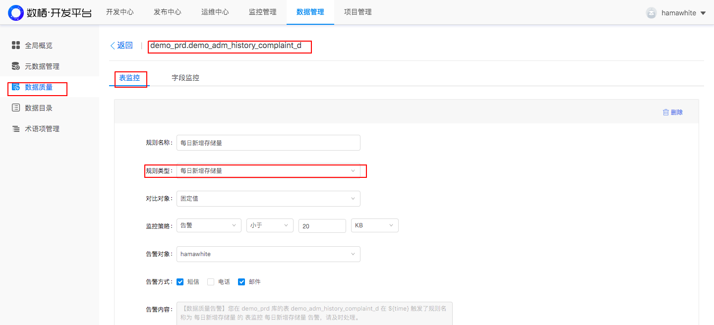<center>图4-6-1 数据质量设置</center>

##### 4.6.2 配置生命周期

在表详情中生命周期信息中，选择需要的周期，点击“确定”按钮，出现系统提示“操作成功”，即设置成功。

<center>图4-6-2 元数据表生命周期设置</center>

##### 4.6.3 查看数据血缘

在元数据管理中，查看生产环境中demo_tdm_user_complaint_position_count_d表的血缘信息。如图4-6-3所示：

<center>图 4-6-3 查看数据血缘</center>

### 5. 视频教程（段誉）

#### 5.1 新建项目空间
#### 5.2 新建函数
#### 5.3 新建、提交、发布任务
#### 5.4 基线管理
#### 5.5 元数据管理
#### 5.6 数据质量

### 6. 常见问题（白松）
### 7. 用户建议（白松）

### 8. Github地址（白松）
